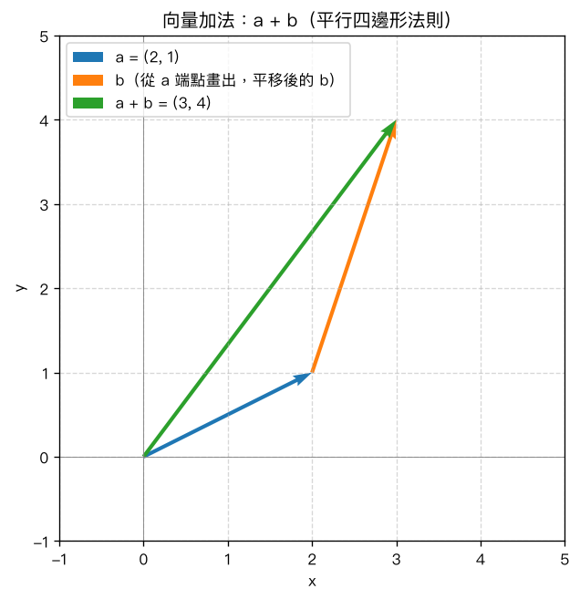
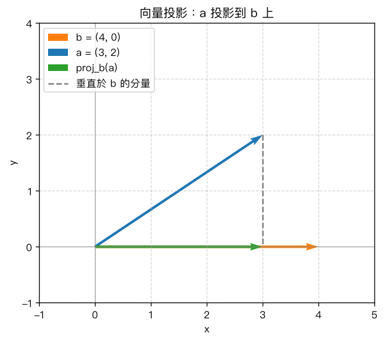

# 第 1 章：向量基礎

## 學習目標

- 理解純量與向量的定義，認識行向量（column vector）與列向量（row vector）的記號
- 熟悉向量加法、純量乘法的計算方式與幾何意義
- 能計算向量的長度（範數），包含 L1、L2、L∞ 三種範數
- 理解內積（dot product）的定義，並用內積計算兩向量夾角、判斷正交性
- 能將任意向量正規化為單位向量，並計算一個向量在另一個向量上的投影

## 概念說明

### 1. 純量與向量

**純量 (scalar)** 是只有大小、沒有方向的量，例如溫度 25°C、質量 3 公斤，通常用一般小寫字母表示，例如 $s = 3$。

**向量 (vector)** 是同時具有大小與方向的量，例如「往東走 5 公尺」。在線性代數中，向量通常寫成一排數字，並用粗體或加箭頭的符號表示，例如 $\vec{v}$ 或 $\mathbf{v}$。

向量有兩種常見的書寫方式：

$$
\text{行向量（column vector）：} \quad
v = \begin{bmatrix} 2 \\ 3 \end{bmatrix}
\qquad\qquad
\text{列向量（row vector）：} \quad
v = \begin{bmatrix} 2 & 3 \end{bmatrix}
$$

兩者本質上是同一組數字，差別只在排列方向（直排或橫排）。在後面章節談到矩陣乘法時，行向量與列向量的區分會變得重要；本章先將它們視為同一個向量的兩種寫法即可。

一個 $n$ 維向量可以想像成 $n$ 維空間中，從原點指向某個點的箭頭。例如二維向量 $(2,3)$ 就是從原點 $(0,0)$ 指向點 $(2,3)$ 的箭頭。

### 2. 向量加法與純量乘法

**向量加法**是將兩個向量「逐分量相加」：

$$
\vec{a} + \vec{b} =
\begin{bmatrix} a_1 \\ a_2 \end{bmatrix} +
\begin{bmatrix} b_1 \\ b_2 \end{bmatrix} =
\begin{bmatrix} a_1 + b_1 \\ a_2 + b_2 \end{bmatrix}
$$

**幾何意義**：把向量 $\vec{b}$ 平移到 $\vec{a}$ 的終點（箭頭處），再從原點畫一條線到 $\vec{b}$ 平移後的終點，這條線就是 $\vec{a}+\vec{b}$。這個做法稱為**平行四邊形法則**，因為 $\vec{a}$、$\vec{b}$、$\vec{a}+\vec{b}$ 恰好構成一個平行四邊形的三邊。

**手算範例**：設 $a=(2,1)$，$b=(1,3)$，則

$$
a+b = (2+1,\ 1+3) = (3,4)
$$

**純量乘法**是把純量 $k$ 乘到向量的每一個分量：

$$
k\vec{a} = k\begin{bmatrix} a_1 \\ a_2 \end{bmatrix} = \begin{bmatrix} ka_1 \\ ka_2 \end{bmatrix}
$$

幾何意義：$k>1$ 會把向量拉長，$0<k<1$ 會把向量縮短，$k<0$ 則會讓向量方向反轉。例如 $2a = (4,2)$，方向與 $a$ 相同但長度變為兩倍。

### 3. 向量的長度／範數

向量的「長度」在數學上稱為**範數 (norm)**，記為 $\|v\|$。最常見的三種範數：

$$
\|v\|_1 = \sum_{i} |v_i|
\qquad\text{(L1 範數，各分量絕對值之和)}
$$

$$
\|v\|_2 = \sqrt{\sum_{i} v_i^2}
\qquad\text{(L2 範數，即歐幾里得長度)}
$$

$$
\|v\|_\infty = \max_i |v_i|
\qquad\text{(L∞ 範數，最大分量的絕對值)}
$$

L2 範數是我們日常直覺中「向量長度」的定義，來自畢氏定理；L1 範數常用於衡量「總移動距離」（如城市街道的曼哈頓距離）；L∞ 範數則只關心最大的那個分量。

**手算範例**：設 $v=(3,-4)$：

$$
\|v\|_1 = |3|+|-4| = 7,\qquad
\|v\|_2 = \sqrt{3^2+(-4)^2} = \sqrt{25} = 5,\qquad
\|v\|_\infty = \max(3,4) = 4
$$

### 4. 內積（dot product）

兩個維度相同的向量 $\vec{u}=(u_1,\dots,u_n)$、$\vec{w}=(w_1,\dots,w_n)$ 的**內積**定義為：

$$
\vec{u}\cdot\vec{w} = \sum_{i=1}^n u_i w_i = u_1w_1 + u_2w_2 + \cdots + u_nw_n
$$

內積的結果是一個純量（一個數字），而不是向量。

**內積與夾角的關係**：兩向量的內積與它們的長度、夾角 $\theta$ 有以下關係：

$$
\vec{u}\cdot\vec{w} = \|\vec{u}\|\,\|\vec{w}\|\cos\theta
\quad\Longleftrightarrow\quad
\cos\theta = \frac{\vec{u}\cdot\vec{w}}{\|\vec{u}\|\,\|\vec{w}\|}
$$

**正交性判斷**：當 $\vec{u}\cdot\vec{w}=0$（且兩向量皆非零向量）時，$\cos\theta=0$，代表 $\theta=90^\circ$，稱兩向量**正交 (orthogonal)**，也就是互相垂直。

**手算範例**：設 $u=(1,2)$，$w=(3,-1)$：

$$
u\cdot w = 1\times3 + 2\times(-1) = 3-2 = 1
$$

$$
\|u\| = \sqrt{1^2+2^2}=\sqrt5,\qquad \|w\| = \sqrt{3^2+(-1)^2}=\sqrt{10}
$$

$$
\cos\theta = \frac{1}{\sqrt5\cdot\sqrt{10}} = \frac{1}{\sqrt{50}} \approx 0.1414
\quad\Rightarrow\quad
\theta \approx 81.87^\circ
$$

再看正交的例子：$p=(1,0)$、$q=(0,1)$，$p\cdot q = 1\times0+0\times1=0$，所以 $p$ 與 $q$ 正交（這正是 $x$ 軸與 $y$ 軸的方向向量）。

### 5. 單位向量（normalize）

**單位向量 (unit vector)** 是長度恰好為 1、但方向與原向量相同的向量。將任意非零向量除以自身的範數（通常用 L2 範數），就能得到該向量的單位向量：

$$
\hat{x} = \frac{\vec{x}}{\|\vec{x}\|_2}
$$

這個過程稱為**正規化 (normalize)**。單位向量常用來表示「純粹的方向」，而不含長度資訊。

**手算範例**：設 $x=(3,4)$，$\|x\|_2=\sqrt{3^2+4^2}=5$，所以

$$
\hat{x} = \left(\frac{3}{5},\ \frac{4}{5}\right) = (0.6,\ 0.8)
$$

驗證：$\|\hat{x}\| = \sqrt{0.6^2+0.8^2} = \sqrt{0.36+0.64} = \sqrt{1} = 1$，確實是單位向量。

### 6. 向量投影（projection）

將向量 $\vec{a}$ **投影**到向量 $\vec{b}$ 上，是指找出 $\vec{a}$ 沿著 $\vec{b}$ 方向的分量。想像光線垂直照在 $\vec{b}$ 上，$\vec{a}$ 在 $\vec{b}$ 上投下的影子，就是投影向量。

**純量投影**（投影的長度，可正可負）：

$$
\text{scalar\_proj}_{\vec{b}}(\vec{a}) = \frac{\vec{a}\cdot\vec{b}}{\|\vec{b}\|}
$$

**向量投影**（把純量投影乘上 $\vec{b}$ 方向的單位向量）：

$$
\operatorname{proj}_{\vec{b}}(\vec{a}) = \frac{\vec{a}\cdot\vec{b}}{\vec{b}\cdot\vec{b}}\,\vec{b}
$$

**手算範例**：設 $a=(3,2)$，$b=(4,0)$：

$$
a\cdot b = 3\times4+2\times0 = 12,\qquad b\cdot b = 4^2+0^2=16
$$

$$
\text{scalar\_proj}_b(a) = \frac{12}{\|b\|} = \frac{12}{4} = 3
$$

$$
\operatorname{proj}_b(a) = \frac{12}{16}(4,0) = (3, 0)
$$

這個結果很合理：$b=(4,0)$ 沿 $x$ 軸方向，而 $a=(3,2)$ 在 $x$ 方向的分量正好是 $3$。

## Python 實作

以下程式碼片段對應 `ch01_vectors.py`（完整程式碼請見該檔案），可直接執行 `python ch01_vectors.py` 查看完整輸出。

### 純量與向量

```python
import numpy as np

scalar = 3.0
print("純量 s =", scalar)

# 行向量（column vector）：形狀 (n, 1)
col_vec = np.array([[2], [3]])
print("行向量 v (column vector), shape =", col_vec.shape)

# 列向量（row vector）：形狀 (n,) 或 (1, n)
row_vec = np.array([2, 3])
print("列向量 v (row vector), shape =", row_vec.shape)
```

在 NumPy 中，`np.array([[2], [3]])` 建立形狀為 `(2, 1)` 的行向量；而 `np.array([2, 3])` 則是形狀 `(2,)` 的一維陣列，一般用來代表向量本身（不特別區分行列）。

### 向量加法與純量乘法

```python
a = np.array([2, 1])
b = np.array([1, 3])

a_plus_b = a + b          # array([3, 4])
k_times_a = 2 * a         # array([4, 2])
```

NumPy 的 `+` 與 `*` 運算子對陣列會自動採用逐元素運算，正好對應數學上的向量加法與純量乘法，不需要手寫迴圈。

### 範數計算

```python
v = np.array([3, -4])

l1_norm = np.linalg.norm(v, ord=1)      # 7.0
l2_norm = np.linalg.norm(v, ord=2)      # 5.0
linf_norm = np.linalg.norm(v, ord=np.inf)  # 4.0
```

`np.linalg.norm` 透過 `ord` 參數切換範數種類：`ord=1` 對應 L1、`ord=2`（預設）對應 L2、`ord=np.inf` 對應 L∞。

### 內積、夾角與正交性

```python
u = np.array([1, 2])
w = np.array([3, -1])

dot_uw = np.dot(u, w)   # 1

cos_theta = dot_uw / (np.linalg.norm(u) * np.linalg.norm(w))
theta_deg = np.degrees(np.arccos(cos_theta))  # 約 81.87 度

p, q = np.array([1, 0]), np.array([0, 1])
np.isclose(np.dot(p, q), 0)   # True -> p 與 q 正交
```

`np.dot` 計算內積；求得 `cos_theta` 後用 `np.arccos` 反推弧度，再用 `np.degrees` 轉成角度。判斷正交性時，因為浮點數運算可能有微小誤差，建議用 `np.isclose` 而非直接比較 `== 0`。

### 單位向量與投影

```python
x = np.array([3, 4])
x_unit = x / np.linalg.norm(x)   # array([0.6, 0.8])

a2 = np.array([3, 2])
b2 = np.array([4, 0])
proj_vec = (np.dot(a2, b2) / np.dot(b2, b2)) * b2   # array([3., 0.])
```

正規化只需將向量除以自身範數；向量投影則是內積比值乘上被投影的向量 $\vec{b}$。

### 向量幾何圖示

程式使用 `matplotlib` 的 `quiver` 繪製箭頭圖，展示向量加法的平行四邊形法則：

```python
import matplotlib
matplotlib.use("Agg")
import matplotlib.pyplot as plt

fig, ax = plt.subplots(figsize=(6, 6))
ax.quiver(0, 0, *a, angles="xy", scale_units="xy", scale=1, color="tab:blue")
ax.quiver(*a, *b, angles="xy", scale_units="xy", scale=1, color="tab:orange")
ax.quiver(0, 0, *a_plus_b, angles="xy", scale_units="xy", scale=1, color="tab:green")
plt.savefig("ch01_vectors/vector_addition.png", dpi=120, bbox_inches="tight")
plt.close()
```

執行後會產生下圖，藍色為 $\vec{a}$、橘色為平移後的 $\vec{b}$、綠色為 $\vec{a}+\vec{b}$：



另一張圖則展示投影的幾何意義，綠色箭頭是 $\vec{a}$ 投影到 $\vec{b}$ 上的結果，灰色虛線是垂直分量：



## MATLAB 實作

以下程式碼片段對應 `ch01_vectors.m`（完整程式碼請見該檔案）。

> 注意：本章 `.m` 檔案已用 GNU Octave 10.2 實際執行驗證通過，輸出數值與本章 Python 版本一致；尚未在正式 MATLAB 環境執行，但語法皆為標準 MATLAB 語法，建議你仍自行在 MATLAB 中重新執行一次確認。

### 純量與向量

```matlab
s = 3.0;
fprintf('純量 s = %.1f\n', s);

% 行向量（column vector）：用分號分隔
v_col = [2; 3];

% 列向量（row vector）：用逗號分隔
v_row = [2, 3];
```

MATLAB 中，分號 `;` 用來分隔「列」（換行），逗號 `,`（或空白）用來分隔「行」中的元素，因此 `[2; 3]` 是行向量，`[2, 3]` 是列向量，恰與 NumPy 的 `(n,1)`／`(n,)` 對應。

### 向量加法與純量乘法

```matlab
a = [2, 1];
b = [1, 3];

a_plus_b = a + b;    % [3, 4]
k_times_a = 2 * a;   % [4, 2]
```

MATLAB 的 `+` 與 `*`（純量乘向量）同樣是逐元素運算，語法與數學式幾乎一致。

### 範數計算

```matlab
v = [3, -4];

l1_norm = norm(v, 1);      % 7
l2_norm = norm(v, 2);      % 5
linf_norm = norm(v, Inf);  % 4
```

MATLAB 內建的 `norm(v, p)` 函式與 NumPy 的 `np.linalg.norm(v, ord=p)` 用法幾乎相同，`p` 可以是 `1`、`2` 或 `Inf`。

### 內積、夾角與正交性

```matlab
u = [1, 2];
w = [3, -1];

dot_uw = dot(u, w);   % 1

cos_theta = dot_uw / (norm(u) * norm(w));
theta_deg = rad2deg(acos(cos_theta));   % 約 81.87 度

p = [1, 0];
q = [0, 1];
dot_pq = dot(p, q);   % 0 -> 正交
```

`dot(u, w)` 計算內積，`acos` 求反餘弦（回傳弧度），再用 `rad2deg` 轉換成角度。

### 單位向量與投影

```matlab
x = [3, 4];
x_unit = x / norm(x);   % [0.6, 0.8]

a2 = [3, 2];
b2 = [4, 0];
proj_vec = (dot(a2, b2) / dot(b2, b2)) * b2;   % [3, 0]
```

寫法與 Python 幾乎一一對應：正規化是「除以範數」，投影是「內積比值乘上 $b$」。

### 向量幾何圖示

```matlab
figure;
hold on;
quiver(0, 0, a(1), a(2), 0, 'LineWidth', 2);
quiver(a(1), a(2), b(1), b(2), 0, 'LineWidth', 2);
quiver(0, 0, a_plus_b(1), a_plus_b(2), 0, 'LineWidth', 2);
axis equal; grid on;
title('向量加法：a + b（平行四邊形法則）');
saveas(gcf, 'vector_addition_matlab.png');
```

MATLAB 的 `quiver(x, y, u, v, 0)` 用來畫箭頭，最後一個參數 `0` 代表關閉自動縮放，讓箭頭長度與座標軸刻度一致（對應數學上的實際長度）。

## 重點整理

- 向量同時具有大小與方向，行向量與列向量只是排列方式不同，本質是同一組數字
- 向量加法遵循平行四邊形法則（逐分量相加）；純量乘法會等比例縮放向量長度，負純量會讓方向反轉
- 範數是衡量向量大小的方式：L1 是各分量絕對值之和、L2 是歐幾里得長度、L∞ 是最大分量絕對值
- 內積 $\vec{u}\cdot\vec{w}=\sum u_iw_i$ 可用來求兩向量夾角（$\cos\theta = \frac{u\cdot w}{\|u\|\|w\|}$），內積為 0 代表兩向量正交
- 單位向量是除以自身範數得到的、長度為 1、方向不變的向量
- 向量投影 $\operatorname{proj}_b(a)=\frac{a\cdot b}{b\cdot b}b$ 描述 $\vec{a}$ 沿 $\vec{b}$ 方向的分量
- Python 用 `numpy` 的 `np.dot`、`np.linalg.norm` 等函式；MATLAB 用內建的 `dot`、`norm` 函式，兩者語法高度對應

## 練習題

1. **（基礎）** 給定 $a=(1,1)$、$b=(2,-1)$，手算 $a+b$ 與 $3a$。
2. **（基礎）** 計算 $v=(6,-8)$ 的 L1、L2、L∞ 範數。
3. **（進階）** 給定 $u=(2,0)$、$w=(0,5)$，判斷兩者是否正交，並用內積公式說明理由。
4. **（進階）** 求 $x=(1,2,2)$（三維向量）的單位向量。（提示：範數公式對任意維度都成立，$\|x\|=\sqrt{1^2+2^2+2^2}$）
5. **（挑戰）** 給定 $a=(1,3)$、$b=(2,2)$，計算 $\operatorname{proj}_b(a)$，並驗證 $a - \operatorname{proj}_b(a)$ 是否與 $b$ 正交（即驗證 $(a-\operatorname{proj}_b(a))\cdot b = 0$）。

### 解答

1. $a+b=(1+2,\ 1+(-1))=(3,0)$；$3a=(3,3)$。
2. $\|v\|_1=6+8=14$；$\|v\|_2=\sqrt{36+64}=\sqrt{100}=10$；$\|v\|_\infty=\max(6,8)=8$。
3. $u\cdot w = 2\times0+0\times5=0$，所以 $u$ 與 $w$ 正交（$u$ 沿 $x$ 軸、$w$ 沿 $y$ 軸，互相垂直）。
4. $\|x\|=\sqrt{1+4+4}=\sqrt9=3$，所以 $\hat{x}=\left(\frac13,\frac23,\frac23\right)\approx(0.333,\ 0.667,\ 0.667)$。
5. $a\cdot b=1\times2+3\times2=8$，$b\cdot b=4+4=8$，所以 $\operatorname{proj}_b(a)=\frac{8}{8}(2,2)=(2,2)$。
   $a-\operatorname{proj}_b(a)=(1-2,\ 3-2)=(-1,1)$。
   驗證：$(-1,1)\cdot(2,2) = -2+2 = 0$，確實正交——這說明「$\vec{a}$ 減去它在 $\vec{b}$ 上的投影」得到的向量，恰好垂直於 $\vec{b}$（這正是投影的幾何本質：投影是 $\vec{a}$ 平行於 $\vec{b}$ 的部分，剩下的就是垂直分量）。
