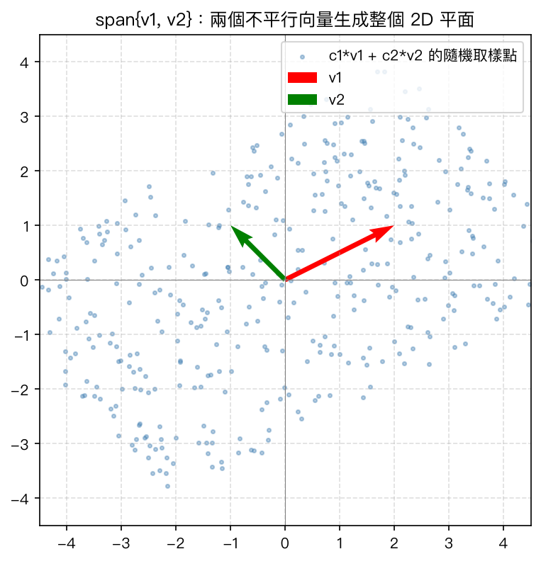
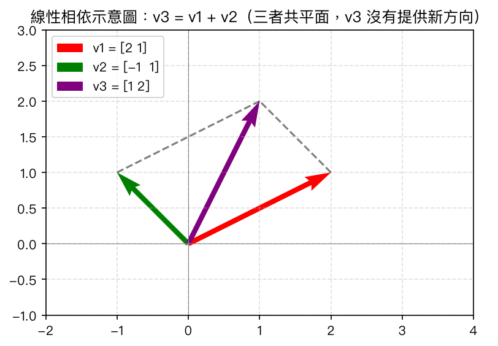

# 第 2 章：線性組合、生成空間與線性獨立

## 學習目標

讀完本章後，你應該能夠：

- 理解「線性組合」的定義，並能手算判斷某個向量是否可以由一組向量的線性組合表示
- 理解「生成空間 (span)」的意義，並能描述幾組簡單向量在幾何上所生成的空間
- 分辨「線性獨立」與「線性相依」的定義，並理解它們在幾何上的意義
- 使用兩種方法判斷一組向量是否線性獨立：解齊次方程組、計算矩陣的秩 (rank)
- 用 Python（NumPy）與 MATLAB 實作上述判斷，並畫出幾何示意圖

---

## 概念說明

### 1. 線性組合 (Linear Combination)

給定一組向量 $v_1, v_2, \dots, v_n$（維度相同）與純量（係數）$c_1, c_2, \dots, c_n$，
它們的**線性組合**定義為：

$$
c_1 v_1 + c_2 v_2 + \cdots + c_n v_n
$$

例如，若 $v_1 = \begin{bmatrix}1\\0\end{bmatrix}$、$v_2 = \begin{bmatrix}0\\1\end{bmatrix}$，取 $c_1 = 3, c_2 = -2$，則：

$$
3 v_1 + (-2) v_2 = \begin{bmatrix}3\\0\end{bmatrix} + \begin{bmatrix}0\\-2\end{bmatrix} = \begin{bmatrix}3\\-2\end{bmatrix}
$$

**手算範例：判斷向量 $b$ 能否表示成線性組合**

設 $v_1 = \begin{bmatrix}1\\0\end{bmatrix}$、$v_2 = \begin{bmatrix}0\\1\end{bmatrix}$，目標向量 $b = \begin{bmatrix}5\\-1\end{bmatrix}$。
我們要找 $c_1, c_2$ 使得：

$$
c_1 \begin{bmatrix}1\\0\end{bmatrix} + c_2 \begin{bmatrix}0\\1\end{bmatrix} = \begin{bmatrix}5\\-1\end{bmatrix}
$$

展開得到 $c_1 = 5$、$c_2 = -1$。由於方程組有解，代表 $b$ 可以表示成 $v_1, v_2$ 的線性組合，
即 $b \in \operatorname{span}\{v_1, v_2\}$。

### 2. 生成空間 (Span)

一組向量 $v_1, \dots, v_n$ 的**生成空間**（span），是指所有可能的線性組合所構成的集合：

$$
\operatorname{span}\{v_1, \dots, v_n\} = \{c_1 v_1 + c_2 v_2 + \cdots + c_n v_n \mid c_1, \dots, c_n \in \mathbb{R}\}
$$

**幾何意義：**

- 單一非零向量 $v$ 的 span，是通過原點、沿著 $v$ 方向的一條**直線**。
- 兩個**不平行**的 2D 向量的 span，會是**整個 2D 平面** $\mathbb{R}^2$（因為任何 2D 向量都能被這兩個方向「湊」出來）。
- 兩個**平行**（其中一個是另一個的純量倍數）的向量，span 仍然只是一條直線 —— 因為第二個向量沒有提供新的方向。

例如 $v_1 = \begin{bmatrix}2\\1\end{bmatrix}$ 與 $v_2 = \begin{bmatrix}-1\\1\end{bmatrix}$ 方向不同（不成比例），
所以 $\operatorname{span}\{v_1, v_2\} = \mathbb{R}^2$，也就是說平面上任一點都可以寫成 $c_1 v_1 + c_2 v_2$ 的形式。

### 3. 線性獨立 (Linear Independence) 與線性相依 (Linear Dependence)

一組向量 $v_1, \dots, v_n$ 稱為**線性獨立**，若齊次方程組

$$
c_1 v_1 + c_2 v_2 + \cdots + c_n v_n = \mathbf{0}
$$

**只有零解** $c_1 = c_2 = \cdots = c_n = 0$。

反之，若存在**不全為零**的係數 $c_1, \dots, c_n$ 使上式成立，則稱這組向量**線性相依**。

直觀理解：線性相依代表這組向量裡至少有一個是「多餘的」——它可以被其他向量的線性組合表示出來，
沒有提供新的方向；線性獨立則代表每個向量都提供了一個「新方向」，沒有向量是多餘的。

**手算範例 1：判斷兩個向量是否線性獨立**

設 $v_1 = \begin{bmatrix}1\\2\end{bmatrix}$、$v_2 = \begin{bmatrix}3\\1\end{bmatrix}$。列出方程組：

$$
c_1 \begin{bmatrix}1\\2\end{bmatrix} + c_2 \begin{bmatrix}3\\1\end{bmatrix} = \begin{bmatrix}0\\0\end{bmatrix}
\quad\Longrightarrow\quad
\begin{cases} c_1 + 3c_2 = 0 \\ 2c_1 + c_2 = 0 \end{cases}
$$

由第一式 $c_1 = -3c_2$，代入第二式：$2(-3c_2) + c_2 = -5c_2 = 0 \Rightarrow c_2 = 0$，
進而 $c_1 = 0$。方程組只有零解，因此 $v_1, v_2$ **線性獨立**。

**手算範例 2：判斷三個 2D 向量是否線性相依**

設 $v_1 = \begin{bmatrix}1\\0\end{bmatrix}$、$v_2 = \begin{bmatrix}0\\1\end{bmatrix}$、$v_3 = v_1 + 2v_2 = \begin{bmatrix}1\\2\end{bmatrix}$。

因為 $v_3 = 1 \cdot v_1 + 2 \cdot v_2$，我們可以改寫成：

$$
1 \cdot v_1 + 2 \cdot v_2 + (-1) \cdot v_3 = \mathbf{0}
$$

這是一組**非零解**（$c_1=1, c_2=2, c_3=-1$ 不全為零），因此 $v_1, v_2, v_3$ **線性相依**。

這也符合直覺：在 2D 平面（$\mathbb{R}^2$）中，最多只能找到 2 個線性獨立的向量；
只要放進第 3 個向量，它必然能表示成前兩個向量的線性組合（前提是前兩個向量已經 span 整個平面）。

### 4. 判斷線性獨立的方法

**方法一：解齊次方程組**

把向量當作矩陣 $A$ 的欄（列）向量，解 $A\mathbf{c} = \mathbf{0}$：

- 若只有零解 $\mathbf{c} = \mathbf{0}$ → 線性獨立
- 若存在非零解 → 線性相依

實務上，我們會用高斯消去法把 $A$ 化簡成列梯形式 (row echelon form)，數出**主元 (pivot)** 的數量。
若主元數量等於向量個數，代表方程組只有零解，即線性獨立。

**方法二：用矩陣的秩 (rank) 判斷**

把 $n$ 個向量排成矩陣 $A$ 的欄，計算 $\operatorname{rank}(A)$：

- 若 $\operatorname{rank}(A) = n$（等於向量個數）→ 線性獨立
- 若 $\operatorname{rank}(A) < n$ → 線性相依

### 5. 秩 (Rank) 的直觀意義

秩，直觀上代表一組向量（或一個矩陣）**實際能撐出的空間維度**。可以把它想成「這組向量裡，
真正提供獨立方向的向量個數」。

- 例如 $\begin{bmatrix}1 & 2\\2 & 4\end{bmatrix}$ 的兩欄向量 $\begin{bmatrix}1\\2\end{bmatrix}$、
  $\begin{bmatrix}2\\4\end{bmatrix}$ 彼此成比例（互相平行），只能撐出一條直線，秩為 1。
- 而 $\begin{bmatrix}1 & 3\\2 & 1\end{bmatrix}$ 的兩欄不平行，可以撐出整個 2D 平面，秩為 2（滿秩）。

秩的完整理論（包括行空間、零空間、秩-零度定理）會在**第 7 章：向量空間、基底與秩**中更深入討論，
本章只需要先建立「秩 = 線性獨立方向的個數」這個直觀概念即可。

---

## Python 實作

以下程式碼節錄自 [`ch02_span_independence.py`](./ch02_span_independence.py)，完整版本可直接執行：

```bash
python ch02_span_independence/ch02_span_independence.py
```

### 線性組合與判斷向量是否落在 span 中

```python
import numpy as np

v1 = np.array([1, 0])
v2 = np.array([0, 1])
c1, c2 = 3, -2
combo = c1 * v1 + c2 * v2
print(combo)  # [ 3 -2]

# 判斷 b 是否可以用 v1, v2 的線性組合表示：解 A c = b
b = np.array([5, -1])
A = np.column_stack([v1, v2])
coeffs, *_ = np.linalg.lstsq(A, b, rcond=None)
print(coeffs)  # [ 5. -1.]
```

### 生成空間 (span) 的幾何示意圖

用大量隨機係數 $(c_1, c_2)$ 產生線性組合 $c_1 v_1 + c_2 v_2$ 的散佈圖，直觀呈現「兩個不平行向量
可以填滿整個 2D 平面」：

```python
v1 = np.array([2, 1])
v2 = np.array([-1, 1])
rng = np.random.default_rng(42)
coeffs = rng.uniform(-2, 2, size=(400, 2))
points = coeffs @ np.array([v1, v2])
# ... 繪圖程式碼見 ch02_span_independence.py
```

執行後會產生下圖，藍色散佈點幾乎均勻覆蓋整個平面：



### 手刻函式：用高斯消去法判斷線性獨立

```python
def is_independent_by_homogeneous_system(vectors, tol=1e-10):
    """把向量排成矩陣欄，化簡列梯形式，數主元個數是否等於向量個數。"""
    A = np.column_stack(vectors).astype(float)
    n_rows, n_cols = A.shape
    M = A.copy()
    pivot_row = 0
    pivot_cols = []
    for col in range(n_cols):
        if pivot_row >= n_rows:
            break
        max_row = pivot_row + np.argmax(np.abs(M[pivot_row:, col]))
        if np.abs(M[max_row, col]) < tol:
            continue
        M[[pivot_row, max_row]] = M[[max_row, pivot_row]]
        for r in range(pivot_row + 1, n_rows):
            factor = M[r, col] / M[pivot_row, col]
            M[r, :] -= factor * M[pivot_row, :]
        pivot_cols.append(col)
        pivot_row += 1
    return len(pivot_cols) == n_cols
```

### 用 `matrix_rank` 判斷線性獨立

```python
v1 = np.array([1, 0])
v2 = np.array([0, 1])
v3 = v1 + 2 * v2  # v3 是 v1, v2 的線性組合
B = np.column_stack([v1, v2, v3])
print(np.linalg.matrix_rank(B))  # 2
print(B.shape[1])                # 3
# rank(B) = 2 < 3 個向量 -> 線性相依
```

執行完整腳本後的終端機輸出摘要（節錄）：

```
範例 A: v1 = [1 2], v2 = [3 1]
  手刻函式判斷 (解齊次方程組是否只有零解): 線性獨立
  matrix_rank(A) = 2, 向量個數 = 2 -> 線性獨立

範例 B: v1 = [1 0], v2 = [0 1], v3 = v1 + 2*v2 = [1 2]
  手刻函式判斷: 線性相依
  matrix_rank(B) = 2, 向量個數 = 3 -> 線性相依
```

### 幾何直觀圖示：線性相依的三個向量

取 $v_1 = \begin{bmatrix}2\\1\end{bmatrix}$、$v_2 = \begin{bmatrix}-1\\1\end{bmatrix}$、
$v_3 = v_1 + v_2 = \begin{bmatrix}1\\2\end{bmatrix}$，畫出平行四邊形法則示意圖：



圖中可以看到 $v_3$ 剛好是 $v_1$ 與 $v_2$ 依平行四邊形法則相加的結果，三者共平面且線性相依。

---

## MATLAB 實作

以下程式碼節錄自 [`ch02_span_independence.m`](./ch02_span_independence.m)：

```matlab
% 線性組合
v1 = [1; 0];
v2 = [0; 1];
c1 = 3; c2 = -2;
combo = c1 * v1 + c2 * v2;
disp(combo);   % [3; -2]

% 判斷 b 是否可以用 v1, v2 的線性組合表示：A \ b 解線性方程組
b = [5; -1];
A = [v1, v2];
coeffs = A \ b;
disp(coeffs);  % [5; -1]
```

判斷線性獨立，使用內建 `rank()` 函式：

```matlab
v1b = [1; 0];
v2b = [0; 1];
v3b = v1b + 2 * v2b;
Bmat = [v1b, v2b, v3b];

r = rank(Bmat);
n = size(Bmat, 2);
if r == n
    disp('線性獨立');
else
    disp('線性相依');   % 這裡會印出這個，因為 rank(Bmat) = 2 < 3
end
```

手刻的高斯消去法函式 `isIndependentByHomogeneousSystem` 定義在 `.m` 檔案結尾（MATLAB 的
local function），邏輯與 Python 版本完全對應：找主元、消去、數主元個數。

MATLAB 版本同樣會產生 `span_demo_matlab.png` 與 `dependent_vectors_demo_matlab.png` 兩張示意圖，
概念與 Python 版本一致（請自行執行 `.m` 檔案以產生圖片並確認結果）。

---

## 重點整理

- **線性組合**：$c_1 v_1 + c_2 v_2 + \cdots + c_n v_n$，係數可以是任意實數。
- **生成空間 (span)**：一組向量所有可能線性組合的集合；兩個不平行的 2D 向量可以 span 出整個平面。
- **線性獨立**：齊次方程組 $c_1 v_1 + \cdots + c_n v_n = \mathbf{0}$ 只有零解 $\Leftrightarrow$ 沒有向量是多餘的。
- **線性相依**：存在非零解 $\Leftrightarrow$ 至少有一個向量可由其他向量的線性組合表示。
- **判斷方法**：解齊次方程組看是否只有零解；或計算矩陣的秩，比較秩與向量個數是否相等。
- **秩的直觀意義**：一組向量「實際能撐出的空間維度」，秩 = 向量個數代表線性獨立；完整理論在第 7 章。

---

## 練習題

**1.** 給定 $v_1 = \begin{bmatrix}1\\1\end{bmatrix}$、$v_2 = \begin{bmatrix}2\\2\end{bmatrix}$，
判斷它們是否線性獨立，並說明 $\operatorname{span}\{v_1, v_2\}$ 的幾何意義（是一條直線還是整個平面？）。

> **提示**：觀察 $v_2$ 是否為 $v_1$ 的純量倍數。
> **答案**：$v_2 = 2v_1$，兩者平行，線性相依；$\operatorname{span}\{v_1, v_2\}$ 只是一條通過原點、
> 斜率為 1 的直線，而不是整個平面。

**2.** 判斷向量 $b = \begin{bmatrix}4\\6\end{bmatrix}$ 是否落在 $\operatorname{span}\left\{\begin{bmatrix}1\\2\end{bmatrix}, \begin{bmatrix}3\\1\end{bmatrix}\right\}$ 中，若是，寫出對應的線性組合係數。

> **提示**：列出 $c_1\begin{bmatrix}1\\2\end{bmatrix} + c_2\begin{bmatrix}3\\1\end{bmatrix} = \begin{bmatrix}4\\6\end{bmatrix}$ 的方程組並求解。
> **答案**：解方程組 $c_1 + 3c_2 = 4,\ 2c_1 + c_2 = 6$ 得 $c_1 = 2.8,\ c_2 = 0.4$（可自行代回驗證）。
> 由於 $v_1, v_2$ 線性獨立且張成整個 $\mathbb{R}^2$，任何 2D 向量都必定落在其 span 中。

**3.** 給定三個向量 $v_1 = \begin{bmatrix}1\\0\\0\end{bmatrix}$、$v_2 = \begin{bmatrix}0\\1\\0\end{bmatrix}$、
$v_3 = \begin{bmatrix}1\\1\\0\end{bmatrix}$，判斷它們是否線性獨立，並用秩驗證你的答案。

> **提示**：注意這三個向量的第三個分量都是 0，它們實際上都落在 $xy$ 平面內。
> **答案**：$v_3 = v_1 + v_2$，因此 $1\cdot v_1 + 1\cdot v_2 + (-1)\cdot v_3 = \mathbf{0}$ 是非零解，
> 線性相依。排成矩陣 $\begin{bmatrix}1&0&1\\0&1&1\\0&0&0\end{bmatrix}$ 的秩為 2，小於向量個數 3，驗證相依。

**4.** 承練習 3，若把 $v_3$ 改成 $\begin{bmatrix}0\\0\\1\end{bmatrix}$，這三個向量是否線性獨立？
用「解齊次方程組」的方式證明你的結論。

> **提示**：這三個向量剛好是 $\mathbb{R}^3$ 的標準基底。
> **答案**：線性獨立。設 $c_1 v_1 + c_2 v_2 + c_3 v_3 = \mathbf{0}$，展開得
> $\begin{bmatrix}c_1\\c_2\\c_3\end{bmatrix} = \begin{bmatrix}0\\0\\0\end{bmatrix}$，直接得到
> $c_1=c_2=c_3=0$，只有零解，故線性獨立（秩為 3，等於向量個數）。

**5.**（思考題）若一組向量中包含零向量 $\mathbf{0}$，這組向量一定線性相依嗎？請說明理由。

> **提示**：試著找出一組非零係數，使線性組合等於零向量。
> **答案**：一定線性相依。因為只要取零向量的係數為任意非零值（例如 1），其他向量係數皆為 0，
> 線性組合 $0\cdot v_1 + \cdots + 1\cdot \mathbf{0} + \cdots = \mathbf{0}$ 就是一組非零解，
> 所以只要一組向量包含零向量，必定線性相依。
