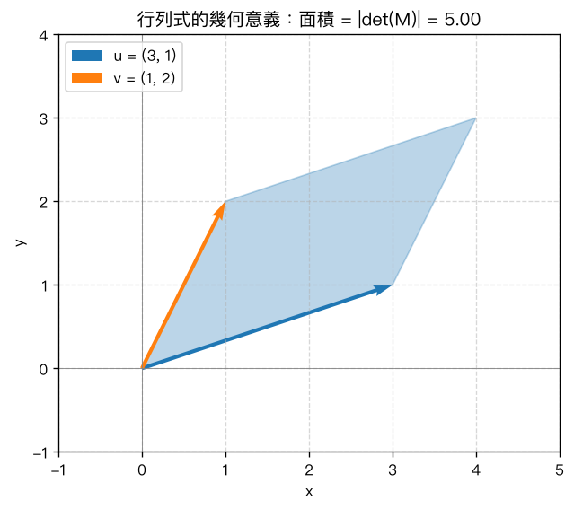
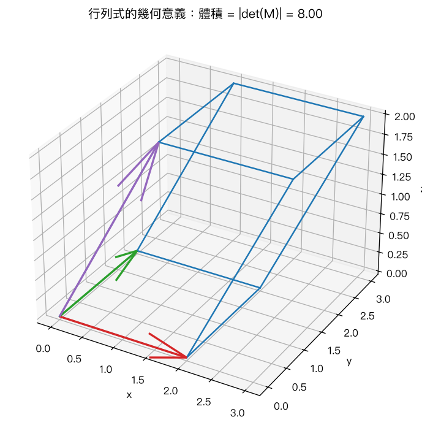

# 第 5 章：行列式

## 學習目標

- 理解並能手算 2×2 行列式（`ad - bc`）
- 理解並能手算 3×3 行列式的餘因子展開（cofactor expansion）
- 熟悉行列式的重要性質：列運算對行列式的影響、轉置不變性、`det(AB) = det(A)det(B)`
- 理解行列式與矩陣可逆性、各列（行）線性相依的關係
- 理解行列式的幾何意義：2D 面積、3D 體積

## 概念說明

行列式（determinant）是一個把方陣（square matrix）映射到一個純量（scalar）的函數，記作 `det(A)` 或 `|A|`。它濃縮了矩陣的許多重要資訊：矩陣是否可逆、線性方程組是否有唯一解、線性變換如何縮放面積或體積等。

### 2×2 行列式

對於一個 2×2 矩陣

```
A = | a  b |
    | c  d |
```

行列式定義為：

```
det(A) = ad - bc
```

**手算範例**

```
A = | 2  3 |
    | 1  4 |
```

```
det(A) = (2)(4) - (3)(1) = 8 - 3 = 5
```

### 3×3 行列式：餘因子展開（cofactor expansion）

對於 3×3 矩陣

```
A = | a11  a12  a13 |
    | a21  a22  a23 |
    | a31  a32  a33 |
```

行列式可以沿「任一列」或「任一行」展開，結果都相同。以沿**第一列**（row 1）展開為例：

```
det(A) = a11 * C11 + a12 * C12 + a13 * C13
```

其中 `Cij = (-1)^(i+j) * Mij`，`Mij` 稱為**餘子式（minor）**，是刪除第 `i` 列與第 `j` 行後剩下的 2×2 子矩陣的行列式；`Cij` 稱為**餘因子（cofactor）**，比餘子式多了正負號 `(-1)^(i+j)`。

**手算範例**（逐步展開）

```
A = | 1  2  3 |
    | 0  4  5 |
    | 1  0  6 |
```

沿第一列（i = 1，對應程式中索引 0）展開，共 3 項：

**第 1 項（j=1）**：刪除第 1 列、第 1 行，剩下

```
| 4  5 |
| 0  6 |   =>  子行列式 = 4*6 - 5*0 = 24
```

符號 `(-1)^(1+1) = +1`，貢獻 = `a11 * (+1) * 24 = 1 * 24 = 24`

**第 2 項（j=2）**：刪除第 1 列、第 2 行，剩下

```
| 0  5 |
| 1  6 |   =>  子行列式 = 0*6 - 5*1 = -5
```

符號 `(-1)^(1+2) = -1`，貢獻 = `a12 * (-1) * (-5) = 2 * (-1) * (-5) = 10`

**第 3 項（j=3）**：刪除第 1 列、第 3 行，剩下

```
| 0  4 |
| 1  0 |   =>  子行列式 = 0*0 - 4*1 = -4
```

符號 `(-1)^(1+3) = +1`，貢獻 = `a13 * (+1) * (-4) = 3 * 1 * (-4) = -12`

**加總**：

```
det(A) = 24 + 10 + (-12) = 22
```

沿任何一列或一行展開都會得到相同結果（本章 Python 程式碼也會驗證沿第一行展開同樣得到 22）。對於更大的 `n x n` 矩陣，餘因子展開可以遞迴地把問題化簡成 `(n-1) x (n-1)` 的子問題，但計算量會隨 `n` 快速增加（時間複雜度約 `O(n!)`），實務上大型矩陣多改用列運算（如 LU 分解）來計算行列式。

### 行列式的重要性質

1. **交換兩列（或兩行），行列式變號**
   若 `B` 是把 `A` 的某兩列互換得到的矩陣，則 `det(B) = -det(A)`。

2. **某一列乘上常數 k，行列式也乘上 k**
   若 `B` 是把 `A` 的某一列整列乘上純量 `k` 得到的矩陣，則 `det(B) = k * det(A)`。
   （注意：若是把整個 `n x n` 矩陣都乘上 `k`，則 `det(kA) = k^n * det(A)`，因為每一列都被放大了 `k` 倍。）

3. **列的倍加（row replacement）不影響行列式**
   若 `B` 是把 `A` 的某一列加上「另一列的倍數」得到的矩陣（例如 `row2 <- row2 + c * row1`），則 `det(B) = det(A)`。這正是高斯消去法中最常用的操作，也是為什麼可以用列運算化簡矩陣為上三角形式後，直接把對角線元素相乘來求行列式。

4. **轉置行列式不變**
   `det(A^T) = det(A)`。因此凡是對「列」成立的性質，對「行」也同樣成立。

5. **乘積的行列式等於行列式的乘積**
   `det(AB) = det(A) * det(B)`。

### 行列式與矩陣可逆性

以下敘述互相等價（對 `n x n` 方陣 `A`）：

```
det(A) = 0   <=>   A 不可逆（奇異矩陣，singular）   <=>   A 的各列（或各行）線性相依
```

反過來說，若 `det(A) != 0`，則 `A` 可逆，且各列（行）線性獨立，`Ax = b` 對任意 `b` 恰有唯一解。這是行列式在判斷線性方程組解的存在性與唯一性時最核心的用途。

### 行列式的幾何意義

- **2D**：若把 2×2 矩陣的兩列（或兩行）看成平面上的兩個向量 `u`、`v`，則 `|det([u; v])|` 恰好等於這兩個向量所張成的**平行四邊形面積**。若 `det` 為負，代表 `v` 相對於 `u` 的方向是「順時針」而非「逆時針」（即定向 orientation 相反），但面積大小仍取絕對值。

- **3D**：同理，3×3 矩陣的三列（或三行）向量 `p`、`q`、`r` 所張成的**平行六面體（parallelepiped）體積**等於 `|det([p; q; r])|`。

- 若行列式為 0，代表向量們「壓扁」了（線性相依），張不出正的面積或體積——這正好呼應「`det(A)=0` 等價於各列線性相依」的結論。

下圖示範 2D 面積與 3D 體積的例子（見 Python 實作章節）：





## Python 實作

本章 Python 程式碼（[`ch05_determinants.py`](ch05_determinants.py)）示範以下內容：

1. 用 `np.linalg.det` 計算 2×2 行列式，並與手算公式 `ad - bc` 比對
2. 手刻 3×3 餘因子展開函式 `cofactor_expansion_3x3`，與 `np.linalg.det` 交叉驗證（用 `np.isclose`）
3. 額外提供遞迴版本 `cofactor_expansion_general`，可處理任意 `n x n` 矩陣，並用 4×4 隨機矩陣驗證
4. 逐一驗證行列式的性質：列交換變號、列乘常數、列的倍加不變、轉置不變、`det(AB) = det(A)det(B)`
5. 用一個可逆矩陣與一個奇異矩陣（singular matrix）示範 `det(A) = 0 <=> A 不可逆`，並示範 `np.linalg.inv` 對奇異矩陣會拋出例外
6. 繪製 2D 平行四邊形面積、3D 平行六面體體積的圖示

```python
import numpy as np

# 2x2 行列式
A2 = np.array([[2, 3], [1, 4]])
print(np.linalg.det(A2))  # 5.0

# 手刻 3x3 餘因子展開，並與內建結果比對
def minor(M, i, j):
    rows = [r for r in range(M.shape[0]) if r != i]
    cols = [c for c in range(M.shape[1]) if c != j]
    return M[np.ix_(rows, cols)]

def cofactor_expansion_3x3(M, expand_row=0):
    i = expand_row
    total = 0.0
    for j in range(3):
        sub = minor(M, i, j)
        sub_det = sub[0, 0] * sub[1, 1] - sub[0, 1] * sub[1, 0]
        total += M[i, j] * ((-1) ** (i + j)) * sub_det
    return total

A3 = np.array([[1, 2, 3], [0, 4, 5], [1, 0, 6]], dtype=float)
print(cofactor_expansion_3x3(A3), np.linalg.det(A3))  # 22.0 22.0（一致）
```

執行方式：

```bash
python ch05_determinants.py
```

執行後會在本章資料夾內產生 `det_area.png`（2D 面積示意圖）與 `det_volume.png`（3D 體積示意圖）。

## MATLAB 實作

MATLAB 提供內建函式 `det()` 直接計算行列式：

```matlab
A2 = [2 3; 1 4];
disp(det(A2))   % 5

A3 = [1 2 3; 0 4 5; 1 0 6];
disp(det(A3))   % 22

% 驗證列交換變號
B = [2 1 0; 1 3 1; 0 1 2];
B_swap = B([2 1 3], :);
disp(det(B_swap) == -det(B))   % 應接近 1（浮點數建議用 abs(...) < tol 比較）
```

完整內容請見 [`ch05_determinants.m`](ch05_determinants.m)。

> 注意：本章 `.m` 檔案已用 GNU Octave 10.2 實際執行驗證通過，輸出數值與本章 Python 版本一致；尚未在正式 MATLAB 環境執行，但語法皆為標準 MATLAB 語法，建議你仍自行在 MATLAB 中重新執行一次確認。

## 重點整理

- 2×2 行列式：`det(A) = ad - bc`。
- 3×3（以上）行列式可用餘因子展開（cofactor expansion）計算：`det(A) = Σ a_ij * (-1)^(i+j) * M_ij`，沿任一列或行展開結果相同。
- 列運算對行列式的影響：交換兩列變號；某列乘 `k` 則行列式乘 `k`；列的倍加不改變行列式。
- `det(A^T) = det(A)`；`det(AB) = det(A) * det(B)`。
- `det(A) = 0` 等價於 `A` 不可逆，也等價於 `A` 的各列（行）線性相依。
- 幾何意義：2D 中 `|det|` 是向量張成的平行四邊形面積；3D 中 `|det|` 是向量張成的平行六面體體積。

## 練習題

1. 手算 `det(A)`，其中 `A = [[5, 2], [3, 4]]`。
   - 提示：套用 `ad - bc`。

2. 用餘因子展開法手算 `det(B)`，其中 `B = [[2, 0, 1], [3, 1, 2], [1, 0, 4]]`，並沿第一列展開。
   - 提示：注意第一列中間元素為 0，該項貢獻會直接為 0，可省去一步計算。

3. 若 `A` 是 4×4 矩陣且 `det(A) = 6`，將 `A` 的第 2 列乘上 -3、再交換第 1 列與第 3 列，求新矩陣的行列式。
   - 提示：先套用「乘常數」性質（乘 -3），再套用「交換兩列變號」性質（乘 -1）。

4. 已知 `det(A) = 0`，請說明 `A` 的各列之間必定存在什麼關係？這對 `Ax = 0` 的解有什麼影響？
   - 提示：想想「線性相依」的定義，以及零空間（null space）是否只有零向量。

5. 給定平面上兩向量 `u = (4, 1)`、`v = (2, 3)`，求它們所張成的平行四邊形面積。
   - 提示：把 `u`、`v` 當作矩陣的兩列（或兩行），面積 = `|det|`。

**答案提示**

1. `det(A) = 5*4 - 2*3 = 20 - 6 = 14`
2. 沿第一列展開：`2 * det([[1,2],[0,4]]) - 0 * (...) + 1 * det([[3,1],[1,0]])`，其中 `det([[1,2],[0,4]]) = 4`、`det([[3,1],[1,0]]) = -1`，故 `det(B) = 2*4 + 1*(-1) = 8 - 1 = 7`
3. `6 * (-3) * (-1) = 18`
4. `A` 的各列線性相依（其中至少一列可表示成其他列的線性組合）；`Ax = 0` 除了零解外，還存在非零解（無窮多解）。
5. 面積 `= |det([[4,1],[2,3]])| = |4*3 - 1*2| = |12 - 2| = 10`
