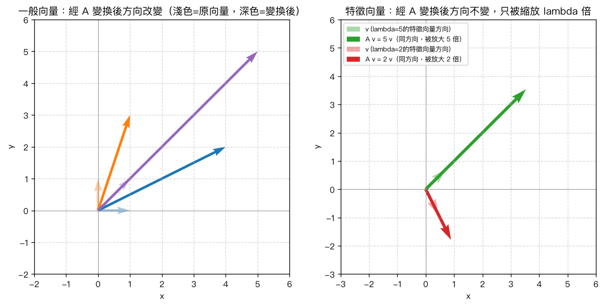

# 第 8 章：特徵值與特徵向量

## 學習目標

讀完本章後，你應該能夠：

- 說出特徵值（eigenvalue）與特徵向量（eigenvector）的定義 $Av = \lambda v$
- 推導特徵方程式 $\det(A - \lambda I) = 0$，並手算一個 $2\times 2$ 矩陣的特徵值與特徵向量
- 說出並驗證特徵值的兩個重要性質：所有特徵值之和等於 $\mathrm{trace}(A)$、所有特徵值之積等於 $\det(A)$
- 解釋對角化 $A = PDP^{-1}$ 的意義，並說出矩陣可對角化的條件
- 用幾何觀點解釋特徵向量：矩陣變換下方向不變、只被拉伸或縮放的向量

## 概念說明

### 1. 特徵值與特徵向量的定義

給定一個 $n \times n$ 方陣 $A$，如果存在一個**非零向量** $v$（$v \neq 0$）與一個純量 $\lambda$，使得

$$
Av = \lambda v
$$

那麼就稱 $\lambda$ 是 $A$ 的**特徵值**（eigenvalue），$v$ 是對應於 $\lambda$ 的**特徵向量**（eigenvector）。

直觀理解：一般來說，矩陣 $A$ 作用在向量 $v$ 上會同時改變 $v$ 的**方向**與**長度**。但對於特徵向量而言，$A$ 作用後只會改變它的**長度**（乘上純量 $\lambda$），方向完全不變（或恰好反向，當 $\lambda<0$）。

> 注意：特徵向量本身不是唯一的——只要 $v$ 是特徵向量，$cv$（$c \neq 0$ 的任意純量）也是同一個特徵值對應的特徵向量。我們通常關心的是「方向」，而不是特定的長度。

### 2. 特徵方程式的推導

要找出 $A$ 的特徵值，從定義出發：

$$
Av = \lambda v \quad \Longleftrightarrow \quad Av - \lambda v = 0 \quad \Longleftrightarrow \quad (A - \lambda I) v = 0
$$

這是一個齊次線性方程組 $(A-\lambda I)v = 0$。我們要找的是**非零解** $v$。根據線性代數的基本定理，一個齊次方程組要有非零解，其係數矩陣必須是**奇異的（不可逆）**，也就是行列式為 0：

$$
\det(A - \lambda I) = 0
$$

這個方程式稱為 $A$ 的**特徵方程式**（characteristic equation）。展開後 $\det(A-\lambda I)$ 是一個關於 $\lambda$ 的 $n$ 次多項式，稱為**特徵多項式**（characteristic polynomial）。求解這個多項式方程式的根，就得到 $A$ 的所有特徵值（$n \times n$ 矩陣共有 $n$ 個特徵值，可能重複，也可能是複數）。

找到每個特徵值 $\lambda$ 之後，把它代回 $(A-\lambda I)v = 0$，解出對應的 $v$，就是該特徵值的特徵向量。

### 3. 手算範例：完整步驟

設

$$
A = \begin{bmatrix} 4 & 1 \\ 2 & 3 \end{bmatrix}
$$

**第一步：寫出 $A - \lambda I$**

$$
A - \lambda I = \begin{bmatrix} 4 & 1 \\ 2 & 3 \end{bmatrix} - \lambda \begin{bmatrix} 1 & 0 \\ 0 & 1 \end{bmatrix} = \begin{bmatrix} 4-\lambda & 1 \\ 2 & 3-\lambda \end{bmatrix}
$$

**第二步：算行列式，得到特徵方程式**

$$
\det(A - \lambda I) = (4-\lambda)(3-\lambda) - (1)(2)
$$

展開：

$$
(4-\lambda)(3-\lambda) - 2 = 12 - 4\lambda - 3\lambda + \lambda^2 - 2 = \lambda^2 - 7\lambda + 10
$$

所以特徵方程式為：

$$
\lambda^2 - 7\lambda + 10 = 0
$$

**第三步：解特徵方程式，求特徵值**

因式分解：

$$
\lambda^2 - 7\lambda + 10 = (\lambda - 5)(\lambda - 2) = 0
$$

得到兩個特徵值：

$$
\lambda_1 = 5, \qquad \lambda_2 = 2
$$

**第四步：求 $\lambda_1 = 5$ 對應的特徵向量**

代入 $(A - \lambda_1 I)v = 0$：

$$
\begin{bmatrix} 4-5 & 1 \\ 2 & 3-5 \end{bmatrix} \begin{bmatrix} x \\ y \end{bmatrix} = \begin{bmatrix} -1 & 1 \\ 2 & -2 \end{bmatrix} \begin{bmatrix} x \\ y \end{bmatrix} = \begin{bmatrix} 0 \\ 0 \end{bmatrix}
$$

第一列給出方程式 $-x + y = 0$，即 $y = x$（第二列 $2x-2y=0$ 是同一條方程式，兩列相依，符合奇異矩陣的預期）。

取 $x=1$，得 $y=1$，所以特徵向量為（任意非零倍數皆可）：

$$
v_1 = \begin{bmatrix} 1 \\ 1 \end{bmatrix}
$$

**第五步：求 $\lambda_2 = 2$ 對應的特徵向量**

代入 $(A - \lambda_2 I)v = 0$：

$$
\begin{bmatrix} 4-2 & 1 \\ 2 & 3-2 \end{bmatrix} \begin{bmatrix} x \\ y \end{bmatrix} = \begin{bmatrix} 2 & 1 \\ 2 & 1 \end{bmatrix} \begin{bmatrix} x \\ y \end{bmatrix} = \begin{bmatrix} 0 \\ 0 \end{bmatrix}
$$

第一列給出 $2x + y = 0$，即 $y = -2x$。取 $x=1$，得 $y=-2$：

$$
v_2 = \begin{bmatrix} 1 \\ -2 \end{bmatrix}
$$

**驗算**：

$$
Av_1 = \begin{bmatrix} 4 & 1 \\ 2 & 3 \end{bmatrix}\begin{bmatrix} 1 \\ 1 \end{bmatrix} = \begin{bmatrix} 5 \\ 5 \end{bmatrix} = 5\begin{bmatrix} 1 \\ 1 \end{bmatrix} = \lambda_1 v_1 \quad \checkmark
$$

$$
Av_2 = \begin{bmatrix} 4 & 1 \\ 2 & 3 \end{bmatrix}\begin{bmatrix} 1 \\ -2 \end{bmatrix} = \begin{bmatrix} 2 \\ -4 \end{bmatrix} = 2\begin{bmatrix} 1 \\ -2 \end{bmatrix} = \lambda_2 v_2 \quad \checkmark
$$

### 4. 特徵值的性質：跡與行列式

對於 $n \times n$ 矩陣 $A$，若特徵值為 $\lambda_1, \lambda_2, \ldots, \lambda_n$（重複的特徵值要算重複次數），則有兩個非常實用的性質：

1. **所有特徵值之和 = $\mathrm{trace}(A)$**（主對角線元素之和）

$$
\sum_{i=1}^{n} \lambda_i = \mathrm{trace}(A)
$$

2. **所有特徵值之積 = $\det(A)$**

$$
\prod_{i=1}^{n} \lambda_i = \det(A)
$$

用上面的範例驗證：$A = \begin{bmatrix} 4 & 1 \\ 2 & 3 \end{bmatrix}$，特徵值為 $\lambda_1=5, \lambda_2=2$。

- $\mathrm{trace}(A) = 4+3 = 7$，而 $\lambda_1+\lambda_2 = 5+2 = 7$ ✓
- $\det(A) = 4\times3 - 1\times2 = 12-2=10$，而 $\lambda_1 \times \lambda_2 = 5\times2=10$ ✓

這兩個性質可以幫助我們快速檢查求得的特徵值是否正確，也常用來在不直接解特徵方程式的情況下推論特徵值的部分資訊。

### 5. 對角化（Diagonalization）

如果一個 $n\times n$ 矩陣 $A$ 擁有 $n$ 個**線性獨立**的特徵向量，就可以把 $A$ 寫成：

$$
A = PDP^{-1}
$$

其中：

- $P$ 是把 $n$ 個特徵向量當作行（column）排在一起組成的矩陣：$P = \begin{bmatrix} v_1 & v_2 & \cdots & v_n \end{bmatrix}$
- $D$ 是把對應的特徵值放在主對角線上的對角矩陣：$D = \mathrm{diag}(\lambda_1, \lambda_2, \ldots, \lambda_n)$

這個過程稱為**對角化**。

**推導**：因為每個 $v_i$ 都滿足 $Av_i = \lambda_i v_i$，把這些關係寫成矩陣形式：

$$
AP = A\begin{bmatrix} v_1 & \cdots & v_n \end{bmatrix} = \begin{bmatrix} Av_1 & \cdots & Av_n \end{bmatrix} = \begin{bmatrix} \lambda_1 v_1 & \cdots & \lambda_n v_n \end{bmatrix} = PD
$$

因為 $n$ 個特徵向量線性獨立，$P$ 是可逆矩陣，兩邊同乘 $P^{-1}$：

$$
A = PDP^{-1}
$$

**用範例驗證**：延續上面 $A = \begin{bmatrix} 4 & 1 \\ 2 & 3 \end{bmatrix}$ 的例子：

$$
P = \begin{bmatrix} 1 & 1 \\ 1 & -2 \end{bmatrix}, \qquad D = \begin{bmatrix} 5 & 0 \\ 0 & 2 \end{bmatrix}
$$

$v_1=(1,1)$ 與 $v_2=(1,-2)$ 明顯不成比例（線性獨立），所以 $P$ 可逆，$A$ 可對角化。（實際數值驗證見下方 Python 實作。）

**何時矩陣可對角化？** 一個 $n\times n$ 矩陣 $A$ 可對角化，**若且唯若**它擁有 $n$ 個線性獨立的特徵向量。

- 如果 $A$ 的 $n$ 個特徵值**互不相同**，則對應的特徵向量必定線性獨立，$A$ 一定可對角化。
- 如果有重複的特徵值（重根），需要檢查該特徵值對應的特徵空間維度（即 $(A-\lambda I)v=0$ 解空間的維度）是否等於重根的重數。若不足，則缺少足夠的線性獨立特徵向量，矩陣**不可對角化**（稱為 defective matrix，缺陷矩陣）。

  例如 $B = \begin{bmatrix} 2 & 1 \\ 0 & 2 \end{bmatrix}$，特徵值為 $\lambda=2$（重根，重數為 2），但 $(B-2I)v=0$ 只能解出 1 維的解空間（只有一個線性獨立的特徵方向），因此 $B$ **不可對角化**。

對角化在計算上非常有用，例如要計算 $A^k$（$A$ 的 $k$ 次方）時，利用 $A = PDP^{-1}$ 可得 $A^k = PD^kP^{-1}$，而 $D^k$ 只需把對角線上每個特徵值各自取 $k$ 次方即可，比直接做 $k$ 次矩陣乘法快得多。

### 6. 幾何意義

矩陣 $A$ 可以看作是一個線性變換：把平面（或空間）中的每個向量 $v$ 映射到新的向量 $Av$。對於**大多數**向量而言，這個變換會同時改變向量的方向與長度。

但特徵向量很特別：$A$ 作用在特徵向量 $v$ 上，得到的 $Av = \lambda v$ 仍然落在 $v$ 所在的同一條直線（同方向或反方向）上，只是長度被縮放了 $|\lambda|$ 倍（若 $\lambda<0$ 則方向反轉）。

- $\lambda > 1$：沿特徵向量方向被拉伸
- $0 < \lambda < 1$：沿特徵向量方向被壓縮
- $\lambda < 0$：方向反轉，同時可能被拉伸或壓縮
- $\lambda = 1$：該方向完全不變

因此，特徵向量給出了矩陣變換中「最特別的方向」——沿著這些方向觀察，矩陣的作用被簡化成單純的縮放。這也是對角化能成立的幾何原因：如果我們用特徵向量作為新的座標軸（基底），矩陣在這組座標系下的作用就只是沿著各軸獨立縮放（也就是對角矩陣 $D$ 的作用）。

下方 Python 實作章節會畫出這個幾何意義的示意圖。

## Python 實作

```python
import numpy as np

A = np.array([[4.0, 1.0],
              [2.0, 3.0]])

# 求特徵值與特徵向量
eigenvalues, eigenvectors = np.linalg.eig(A)
print("特徵值 =", eigenvalues)
print("特徵向量矩陣 =\n", eigenvectors)

# 驗證 A @ v ≈ lambda * v
v1 = eigenvectors[:, 0]
lam1 = eigenvalues[0]
print(np.allclose(A @ v1, lam1 * v1))  # True

# 驗證性質：特徵值和 = trace(A)，特徵值積 = det(A)
print(np.allclose(np.sum(eigenvalues), np.trace(A)))       # True
print(np.allclose(np.prod(eigenvalues), np.linalg.det(A)))  # True

# 對角化 A = P D P^-1
P = eigenvectors
D = np.diag(eigenvalues)
A_reconstructed = P @ D @ np.linalg.inv(P)
print(np.allclose(A_reconstructed, A))  # True
```

完整程式碼請見 [`ch08_eigenvalues.py`](ch08_eigenvalues.py)，可直接執行：

```bash
python ch08_eigenvalues/ch08_eigenvalues.py
```

執行後會產生下方的幾何意義示意圖：



左圖顯示一般向量經過 $A$ 變換後方向會改變；右圖顯示特徵向量方向經過 $A$ 變換後完全不變，只是長度被放大了 $\lambda$ 倍（綠色方向被放大 5 倍，紅色方向被放大 2 倍且反向繪製於下方以便觀察）。

## MATLAB 實作

```matlab
A = [4 1; 2 3];

% 求特徵值與特徵向量：[V, D] = eig(A)
% V 的每一行 column 是一個特徵向量，D 是特徵值組成的對角矩陣
[V, D] = eig(A);
disp(D)   % 對角線上就是特徵值
disp(V)   % 每一行是對應的特徵向量

% 驗證 A*v = lambda*v
v1 = V(:, 1);
lambda1 = D(1, 1);
disp(A * v1 - lambda1 * v1)   % 應接近零向量

% 特徵值的性質
disp(trace(A))          % 特徵值之和
disp(sum(diag(D)))
disp(det(A))             % 特徵值之積
disp(prod(diag(D)))

% 對角化重建 A
A_reconstructed = V * D * inv(V);
disp(A_reconstructed)
```

完整程式碼請見 [`ch08_eigenvalues.m`](ch08_eigenvalues.m)。

> 注意：本章 `.m` 檔案已用 GNU Octave 10.2 實際執行驗證通過，輸出數值與本章 Python 版本一致；尚未在正式 MATLAB 環境執行，但語法皆為標準 MATLAB 語法，建議你仍自行在 MATLAB 中重新執行一次確認。

## 重點整理

- 特徵值/特徵向量定義：$Av = \lambda v$，其中 $v \neq 0$。
- 特徵值由特徵方程式 $\det(A - \lambda I) = 0$ 求得；代回 $(A-\lambda I)v=0$ 可解出對應的特徵向量。
- 特徵值性質：$\sum \lambda_i = \mathrm{trace}(A)$、$\prod \lambda_i = \det(A)$，可用來檢查計算結果。
- 對角化 $A = PDP^{-1}$：$P$ 的行是特徵向量、$D$ 的對角線是特徵值；矩陣可對角化的條件是擁有 $n$ 個線性獨立的特徵向量。
- 特徵值互不相同時必可對角化；有重根時需檢查特徵空間維度是否足夠。
- 幾何意義：特徵向量是矩陣變換下方向不變（只被縮放 $\lambda$ 倍）的特殊方向。

## 練習題

1. 求矩陣 $A = \begin{bmatrix} 2 & 0 \\ 0 & 3 \end{bmatrix}$ 的特徵值與特徵向量。

   > 提示：對角矩陣的特徵值就是對角線上的元素本身：$\lambda_1=2$（特徵向量 $(1,0)$）、$\lambda_2=3$（特徵向量 $(0,1)$）。

2. 求矩陣 $A = \begin{bmatrix} 1 & 2 \\ 2 & 1 \end{bmatrix}$ 的特徵值與特徵向量，並驗證特徵值之和等於 $\mathrm{trace}(A)$、之積等於 $\det(A)$。

   > 提示：特徵方程式為 $\lambda^2 - 2\lambda - 3 = 0$，解得 $\lambda_1=3$（特徵向量 $(1,1)$）、$\lambda_2=-1$（特徵向量 $(1,-1)$）。$\mathrm{trace}(A)=2=3+(-1)$；$\det(A)=1-4=-3=3\times(-1)$。

3. 判斷矩陣 $A = \begin{bmatrix} 1 & 1 \\ 0 & 1 \end{bmatrix}$ 是否可對角化。

   > 提示：特徵方程式 $(1-\lambda)^2=0$，$\lambda=1$ 為重根（重數 2）。代入 $(A-I)v=0$ 得 $\begin{bmatrix}0&1\\0&0\end{bmatrix}v=0$，解空間只有 1 維，特徵向量不足 2 個線性獨立方向，故**不可對角化**。

4. 設 $A$ 是 $3\times 3$ 矩陣，已知其中兩個特徵值為 $2$ 與 $-1$，且 $\det(A) = -6$。求第三個特徵值。

   > 提示：利用 $\prod \lambda_i = \det(A)$：$2 \times (-1) \times \lambda_3 = -6 \Rightarrow \lambda_3 = 3$。

5. 對矩陣 $A = \begin{bmatrix} 4 & 1 \\ 2 & 3 \end{bmatrix}$（本章手算範例），寫出對角化 $A=PDP^{-1}$ 的 $P$ 與 $D$，並說明為什麼此矩陣一定可對角化。

   > 提示：$P=\begin{bmatrix}1&1\\1&-2\end{bmatrix}$、$D=\begin{bmatrix}5&0\\0&2\end{bmatrix}$。因為兩個特徵值 $5 \neq 2$ 互不相同，對應的特徵向量必定線性獨立，所以一定可對角化。
