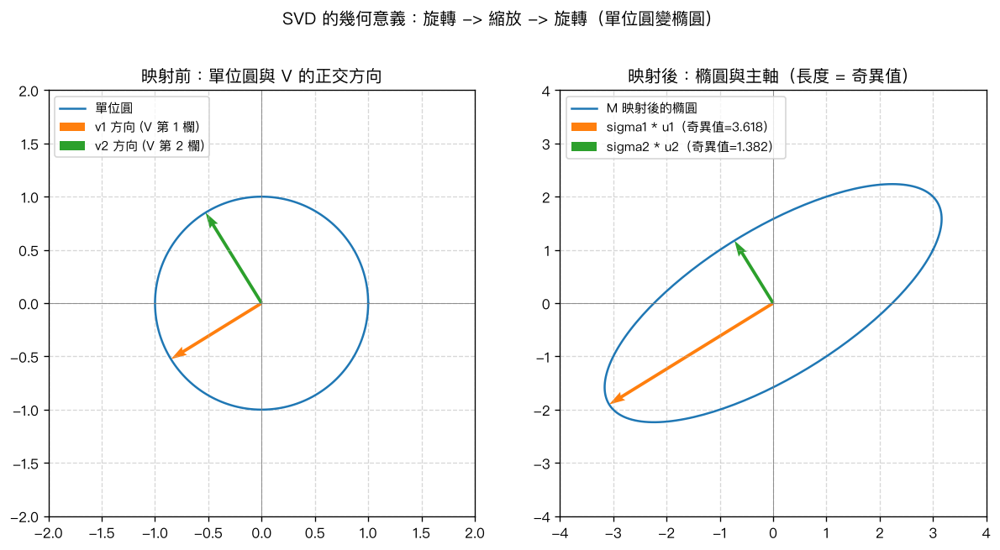

# 第 10 章：奇異值分解（SVD）

## 學習目標

讀完本章後，你應該能夠：

- 寫出任意 $m \times n$ 矩陣的奇異值分解（SVD）$A = U \Sigma V^T$，並說出 $U$、$\Sigma$、$V$ 各自的形狀與性質
- 說明 SVD 與特徵值分解的關係：奇異值是 $A^T A$（或 $AA^T$）特徵值的平方根
- 解釋 SVD 的幾何意義：「旋轉 → 縮放 → 旋轉」，並理解單位圓如何被映射成橢圓
- 用奇異值的個數判斷矩陣的秩（rank）
- 寫出 Moore-Penrose 偽逆的定義，並用 SVD 計算偽逆
- 手算一個簡單 $2\times 2$ 矩陣的完整 SVD（$U$、$\Sigma$、$V$）

## 概念說明

### 1. 為什麼需要 SVD？

前面幾章介紹的特徵值分解 $A = P D P^{-1}$，只適用於**方陣**，而且不是每個方陣都能對角化。但在真實世界的資料中，矩陣經常是**長方形**的（例如：$m$ 筆資料、$n$ 個特徵，$m \neq n$），或者即使是方陣也可能不可逆。

**奇異值分解（Singular Value Decomposition, SVD）** 解決了這個限制：**任何** $m \times n$ 矩陣，不論是不是方陣、可不可逆，都能分解。這也是 SVD 被稱為線性代數中「最實用的分解」的原因，後面第 11 章（最小二乘法）、第 12 章（PCA）都會直接建立在 SVD 之上。

### 2. SVD 的定義

任意 $m \times n$ 實矩陣 $A$，都可以分解成：

$$
A = U \Sigma V^T
$$

其中：

- $U$ 是 $m \times m$ 的**正交矩陣**（orthogonal matrix），滿足 $U^T U = U U^T = I_m$。$U$ 的欄向量稱為**左奇異向量**（left singular vectors）。
- $\Sigma$ 是 $m \times n$ 的**對角矩陣**（廣義的對角矩陣，長方形時只有左上角是對角線，其餘補零），對角線上的元素 $\sigma_1 \geq \sigma_2 \geq \cdots \geq \sigma_r > 0$ 稱為**奇異值**（singular values），且由大到小排列。
- $V$ 是 $n \times n$ 的**正交矩陣**，滿足 $V^T V = V V^T = I_n$。$V$ 的欄向量稱為**右奇異向量**（right singular vectors）。

用維度圖示表示：

$$
\underbrace{A}_{m\times n} = \underbrace{U}_{m\times m}\;\underbrace{\Sigma}_{m\times n}\;\underbrace{V^T}_{n\times n}
$$

**正交矩陣的意義**：$U$、$V$ 的欄向量彼此正交且長度為 1（單位正交基），乘上正交矩陣只會「旋轉」或「鏡射」空間，不會改變向量長度。這正是「SVD = 旋轉 → 縮放 → 旋轉」說法的來源（見第 4 節）。

### 3. SVD 與特徵值分解的關係

SVD 看起來和特徵值分解很不一樣，但其實可以直接從 $A^T A$、$A A^T$ 的特徵分解推導出來。

把 $A = U\Sigma V^T$ 代入 $A^T A$：

$$
A^T A = (U\Sigma V^T)^T (U\Sigma V^T) = V \Sigma^T U^T U \Sigma V^T = V (\Sigma^T \Sigma) V^T
$$

（因為 $U^T U = I$）。注意 $\Sigma^T \Sigma$ 是一個 $n \times n$ 的**對角矩陣**，對角線元素恰為 $\sigma_i^2$。

所以上式 $A^T A = V (\Sigma^T \Sigma) V^T$，正好就是 $A^T A$ 的**特徵分解**！這告訴我們：

- **$V$ 的欄是 $A^T A$ 的特徵向量**
- **$\Sigma^T \Sigma$ 的對角線（也就是 $\sigma_i^2$）是 $A^T A$ 的特徵值**，也就是說：
  $$
  \sigma_i = \sqrt{\lambda_i(A^T A)}
  $$

同理，把 $A = U\Sigma V^T$ 代入 $A A^T$：

$$
A A^T = U\Sigma V^T V \Sigma^T U^T = U(\Sigma \Sigma^T) U^T
$$

所以：

- **$U$ 的欄是 $AA^T$ 的特徵向量**
- $\Sigma \Sigma^T$（$m\times m$ 對角矩陣）的對角線同樣是 $\sigma_i^2$（多出來的部分補 0）

因為 $A^T A$ 與 $A A^T$ 都是**對稱矩陣**（symmetric），根據第 8 章的結論，對稱矩陣一定可以正交對角化，且特徵值必為實數；又因為 $A^T A$ 是**半正定**的（半正定矩陣的所有特徵值 $\geq 0$），所以 $\sigma_i^2 \geq 0$，才能安心開根號得到實數的奇異值 $\sigma_i$。這就是 SVD **對任意矩陣都存在**的原因。

### 4. 幾何意義：旋轉 → 縮放 → 旋轉

對向量 $x$ 作用 $A$，等同於依序做三件事：

$$
Ax = U \Sigma V^T x
$$

1. **$V^T x$**：因為 $V^T$ 是正交矩陣，這一步只是把 $x$ 用一組新的正交基座標表示，幾何上相當於**旋轉**（或鏡射）。
2. **$\Sigma (\cdot)$**：$\Sigma$ 是對角矩陣，把每個座標軸方向分別**縮放** $\sigma_1, \sigma_2, \ldots$ 倍。
3. **$U(\cdot)$**：$U$ 同樣是正交矩陣，再做一次**旋轉**（或鏡射）。

**單位圓變橢圓**：考慮一個 $2\times 2$ 矩陣 $M$，把平面上的單位圓（所有滿足 $\|x\|=1$ 的點）做映射 $x \mapsto Mx$。因為單位圓上的點可以寫成 $x = V^T$ 座標系中的單位圓（旋轉不改變圓），縮放之後就變成一個**橢圓**，橢圓的兩個**主軸方向**正是 $U$ 的欄向量 $u_1, u_2$，主軸的**半長**正是奇異值 $\sigma_1, \sigma_2$。也就是說：

$$
\text{橢圓的主軸} = \sigma_i \, u_i
$$

這正是 SVD 名稱中「奇異值」的幾何意義：它們是矩陣在各個正交方向上的「伸縮倍率」。程式碼一節會實際畫出這個單位圓變橢圓的圖。

### 5. 用 SVD 計算矩陣的秩

矩陣的秩（rank）等於**非零奇異值的個數**：

$$
\mathrm{rank}(A) = \#\{i : \sigma_i > 0\}
$$

直觀理解：奇異值 $\sigma_i = 0$ 代表在 $V$ 的第 $i$ 個方向上，$A$ 把該方向「壓扁」成 0（完全沒有伸縮，等於被消滅），對輸出空間沒有貢獻。有幾個方向「存活」下來（$\sigma_i > 0$），輸出空間就有幾維，也就是秩。

在數值計算中，由於浮點數誤差，真正的 0 可能算出很小的非零數，因此實務上會設定一個容忍誤差（tolerance），奇異值小於這個門檻就視為 0。

### 6. Moore-Penrose 偽逆（Pseudo-Inverse）

當 $A$ 不是方陣，或是方陣但不可逆時，一般的反矩陣 $A^{-1}$ 不存在。**Moore-Penrose 偽逆** $A^+$ 是反矩陣概念的推廣，對任意 $m \times n$ 矩陣都存在，且用 SVD 可以直接寫出來：

$$
A^+ = V \Sigma^+ U^T
$$

其中 $\Sigma^+$ 是把 $\Sigma$ **轉置**、並把每個非零奇異值取**倒數**得到的 $n \times m$ 矩陣：

$$
\Sigma = \begin{bmatrix} \sigma_1 & & \\ & \ddots & \\ & & \sigma_r \\ & & & 0 \end{bmatrix}_{m\times n}
\quad\Longrightarrow\quad
\Sigma^+ = \begin{bmatrix} 1/\sigma_1 & & \\ & \ddots & \\ & & 1/\sigma_r \\ & & & 0 \end{bmatrix}_{n\times m}
$$

（奇異值為 0 的位置在 $\Sigma^+$ 中維持為 0，不能取倒數。）

偽逆滿足以下重要性質：

- 若 $A$ 是方陣且可逆，則 $A^+ = A^{-1}$（偽逆退化為一般反矩陣）。
- $A A^+ A = A$，$A^+ A A^+ = A^+$（Moore-Penrose 四條性質中的兩條）。
- **最重要的應用**：當線性方程組 $Ax = b$ 無解（$A$ 為長方形、方程數與未知數不匹配）或有無限多解時，$x^* = A^+ b$ 給出**最小二乘意義下最好的解**——即讓 $\|Ax - b\|$ 最小的 $x$（若有多組解，則挑長度 $\|x\|$ 最小的那一組）。這個概念會在第 11 章（最小二乘法）詳細展開，SVD／偽逆正是它背後的理論基礎。

### 7. 手算範例：$2\times 2$ 矩陣的完整 SVD

設

$$
B = \begin{bmatrix} 1 & 1 \\ 0 & 1 \end{bmatrix}
$$

**第一步：算 $B^T B$**

$$
B^T B = \begin{bmatrix} 1 & 0 \\ 1 & 1 \end{bmatrix}\begin{bmatrix} 1 & 1 \\ 0 & 1 \end{bmatrix} = \begin{bmatrix} 1 & 1 \\ 1 & 2 \end{bmatrix}
$$

**第二步：求 $B^T B$ 的特徵值**

特徵方程式：

$$
\det(B^T B - \lambda I) = \det\begin{bmatrix} 1-\lambda & 1 \\ 1 & 2-\lambda \end{bmatrix} = (1-\lambda)(2-\lambda) - 1 = \lambda^2 - 3\lambda + 1 = 0
$$

用二次公式解：

$$
\lambda = \frac{3 \pm \sqrt{9-4}}{2} = \frac{3\pm\sqrt5}{2}
$$

所以 $\lambda_1 = \dfrac{3+\sqrt5}{2} \approx 2.618$，$\lambda_2 = \dfrac{3-\sqrt5}{2} \approx 0.382$（兩者剛好是黃金比例 $\varphi^2$ 與 $1/\varphi^2$，純屬巧合但方便驗算）。

**第三步：奇異值 = 特徵值開根號**

$$
\sigma_1 = \sqrt{\lambda_1} \approx \sqrt{2.618} \approx 1.618, \qquad \sigma_2 = \sqrt{\lambda_2} \approx \sqrt{0.382} \approx 0.618
$$

**第四步：求特徵向量得到 $V$**

對 $\lambda_1 \approx 2.618$，解 $(B^T B - \lambda_1 I)v = 0$：

$$
\begin{bmatrix} 1-2.618 & 1 \\ 1 & 2-2.618 \end{bmatrix} v = 0 \;\Longrightarrow\; \begin{bmatrix} -1.618 & 1 \\ 1 & -0.618 \end{bmatrix} v = 0
$$

由第一列得 $v_2 = 1.618\, v_1$，取 $v_1=1$ 得方向 $(1, 1.618)$，單位化後：

$$
v_1 = \frac{1}{\sqrt{1^2+1.618^2}}\begin{bmatrix}1\\1.618\end{bmatrix} \approx \begin{bmatrix}0.526\\0.851\end{bmatrix}
$$

同理，對 $\lambda_2 \approx 0.382$ 可解出正交於 $v_1$ 的方向，單位化後：

$$
v_2 \approx \begin{bmatrix}0.851\\-0.526\end{bmatrix} \quad (\text{或反號 } \begin{bmatrix}-0.851\\0.526\end{bmatrix})
$$

因此

$$
V \approx \begin{bmatrix} 0.526 & 0.851 \\ 0.851 & -0.526 \end{bmatrix}
$$

**第五步：由 $u_i = \dfrac{1}{\sigma_i} B v_i$ 求出 $U$**

$$
u_1 = \frac{1}{\sigma_1} B v_1 = \frac{1}{1.618}\begin{bmatrix}1&1\\0&1\end{bmatrix}\begin{bmatrix}0.526\\0.851\end{bmatrix} = \frac{1}{1.618}\begin{bmatrix}1.377\\0.851\end{bmatrix} \approx \begin{bmatrix}0.851\\0.526\end{bmatrix}
$$

$$
u_2 = \frac{1}{\sigma_2} B v_2 = \frac{1}{0.618}\begin{bmatrix}1&1\\0&1\end{bmatrix}\begin{bmatrix}0.851\\-0.526\end{bmatrix} = \frac{1}{0.618}\begin{bmatrix}0.325\\-0.526\end{bmatrix} \approx \begin{bmatrix}0.526\\-0.851\end{bmatrix}
$$

**結果**：

$$
B \approx \underbrace{\begin{bmatrix}0.851 & 0.526\\0.526 & -0.851\end{bmatrix}}_{U}
\underbrace{\begin{bmatrix}1.618 & 0\\0 & 0.618\end{bmatrix}}_{\Sigma}
\underbrace{\begin{bmatrix}0.526 & 0.851\\0.851 & -0.526\end{bmatrix}}_{V^T}
$$

這個結果與程式碼一節用 `numpy.linalg.svd` 算出的值一致（差異僅在正負號選取，這是 SVD 本身固有的不唯一性——每一對 $(u_i, v_i)$ 同時乘上 $-1$ 仍然是合法解）。

## Python 實作

用 `numpy.linalg.svd` 對矩陣 $A$（$3\times 2$）做分解，並驗證重建結果：

```python
import numpy as np

A = np.array([
    [3.0, 0.0],
    [4.0, 5.0],
    [0.0, 0.0],
])

# full_matrices=True: U 是 m x m、Vt 是 n x n（完整版 SVD）
U, s, Vt = np.linalg.svd(A, full_matrices=True)

# 把一維奇異值陣列 s 組裝成 m x n 的對角矩陣 Sigma
m, n = A.shape
Sigma = np.zeros((m, n))
Sigma[: len(s), : len(s)] = np.diag(s)

# 驗證 A = U @ Sigma @ V^T
print(np.allclose(U @ Sigma @ Vt, A))   # True
```

用奇異值個數判斷秩、用 SVD 手算偽逆並與 `np.linalg.pinv` 比較：

```python
# 秩 = 非零奇異值個數
rank = np.sum(s > 1e-10)

# 偽逆 A^+ = V Sigma^+ U^T
V = Vt.T
Sigma_pinv = np.zeros((n, m))
for i in range(len(s)):
    if s[i] > 1e-10:
        Sigma_pinv[i, i] = 1.0 / s[i]

A_pinv_manual = V @ Sigma_pinv @ U.T
print(np.allclose(A_pinv_manual, np.linalg.pinv(A)))  # True
```

執行後的完整輸出包含：SVD 重建驗證、$A^TA$／$AA^T$ 與奇異值平方的關係、$2\times2$ 矩陣手算範例、秩的驗證、偽逆與最小二乘解的驗證。完整程式碼請見 [`ch10_svd.py`](ch10_svd.py)，可直接執行：

```bash
python ch10_svd/ch10_svd.py
```

執行後會在本章資料夾產生以下示意圖，展示單位圓如何被 $2\times2$ 矩陣 $M=\begin{bmatrix}3&1\\1&2\end{bmatrix}$ 映射成橢圓（左圖：映射前的單位圓與 $V$ 的正交方向；右圖：映射後的橢圓，主軸方向為 $U$ 的欄、主軸半長為奇異值）：



## MATLAB 實作

```matlab
A = [3 0; 4 5; 0 0];

[U, S, V] = svd(A);      % 完整版 SVD：A = U * S * V'
disp(U * S * V' - A);    % 應接近全零矩陣

r = rank(A);              % 直接算秩
A_pinv = pinv(A);         % 直接算 Moore-Penrose 偽逆

x = A_pinv * b;            % 最小二乘解 x = A^+ b
```

完整程式碼請見 [`ch10_svd.m`](ch10_svd.m)。

> 注意：本章 `.m` 檔案已用 GNU Octave 10.2 實際執行驗證通過，輸出數值與本章 Python 版本一致；尚未在正式 MATLAB 環境執行，但語法皆為標準 MATLAB 語法，建議你仍自行在 MATLAB 中重新執行一次確認。

## 重點整理

- 任意 $m\times n$ 矩陣都能分解為 $A = U\Sigma V^T$，$U$（$m\times m$）與 $V$（$n\times n$）皆為正交矩陣，$\Sigma$（$m\times n$）的對角線是由大到小排列的奇異值 $\sigma_1 \geq \sigma_2 \geq \cdots \geq 0$。
- 奇異值是 $A^TA$（或 $AA^T$）特徵值的平方根：$\sigma_i = \sqrt{\lambda_i(A^TA)}$；$V$ 的欄是 $A^TA$ 的特徵向量，$U$ 的欄是 $AA^T$ 的特徵向量。
- 幾何上，SVD 是「旋轉（$V^T$）→ 縮放（$\Sigma$）→ 旋轉（$U$）」的組合；$2\times2$ 矩陣會把單位圓映射成橢圓，橢圓主軸方向為 $U$ 的欄、半長為奇異值。
- 矩陣的秩 = 非零奇異值的個數。
- Moore-Penrose 偽逆 $A^+ = V\Sigma^+U^T$（$\Sigma^+$ 是把非零奇異值取倒數再轉置），可推廣反矩陣到任意矩陣；$x^*=A^+b$ 給出 $Ax=b$ 的最小二乘解，是第 11 章的理論基礎。
- SVD 對任意矩陣都存在，不需要矩陣可對角化，比特徵值分解更通用。

## 練習題

1. 設 $A = \begin{bmatrix} 2 & 0 \\ 0 & 3 \end{bmatrix}$。不用電腦，直接寫出 $A$ 的 SVD（提示：$A$ 已經是對角矩陣，且對角元素皆為正數）。

   > 提示：$A$ 本身已經是對角矩陣且奇異值需由大到小排列，所以 $U=I$、$V=I$、$\Sigma=\begin{bmatrix}3&0\\0&2\end{bmatrix}$，但要注意排序後 $V$ 的欄需要交換對應的行，因此 $U=\begin{bmatrix}0&1\\1&0\end{bmatrix}$、$V=\begin{bmatrix}0&1\\1&0\end{bmatrix}$，使得 $\sigma_1=3,\sigma_2=2$；直接驗證 $U\Sigma V^T=A$。

2. 承第 7 節手算範例的矩陣 $B=\begin{bmatrix}1&1\\0&1\end{bmatrix}$，驗證 $\det(B) = \sigma_1 \sigma_2$（提示：對任意方陣，$|\det(A)| = \sigma_1\sigma_2\cdots\sigma_n$）。

   > 提示：$\det(B) = 1$，$\sigma_1\sigma_2 \approx 1.618 \times 0.618 \approx 1$，兩者一致。

3. 矩陣 $C = \begin{bmatrix} 1 & 2 \\ 2 & 4 \end{bmatrix}$ 的兩列成比例（線性相依）。不計算就判斷：$C$ 有幾個非零奇異值？$\mathrm{rank}(C)$ 是多少？

   > 提示：因為兩列線性相依，$\mathrm{rank}(C)=1$，所以只有 1 個非零奇異值，另一個奇異值為 0。

4. 設 $A$ 是 $5\times 3$ 矩陣且 $\mathrm{rank}(A)=3$（欄滿秩）。問：$A$ 的偽逆 $A^+$ 的形狀是多少？並說明 $A^+ A$ 會等於什麼矩陣。

   > 提示：$A^+$ 的形狀是 $3\times 5$（$n\times m$）；因為 $A$ 欄滿秩，$A^+A = I_3$（$3\times3$ 單位矩陣）。

5. 對於 $2\times2$ 矩陣 $M=\begin{bmatrix}3&1\\1&2\end{bmatrix}$（即程式碼範例中的矩陣），若把單位圓上最靠近 $v_1$ 方向的點（也就是 $x=v_1$）代入 $Mx$，得到的向量長度應該是多少？為什麼？

   > 提示：長度應為 $\sigma_1$（最大奇異值），因為 $M v_1 = \sigma_1 u_1$ 且 $u_1$ 是單位向量，所以 $\|Mv_1\| = \sigma_1 \approx 3.618$。
