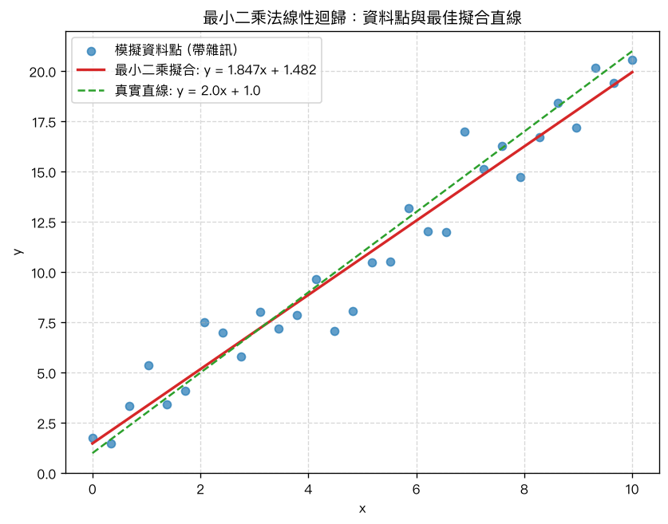

# 第 11 章：最小二乘法與線性迴歸

## 學習目標

讀完本章後，你應該能夠：

- 說明什麼是超定方程組（overdetermined system），以及為什麼 $Ax=b$ 通常無解
- 理解最小二乘法的核心目標：最小化殘差平方和 $\|Ax-b\|^2$
- 推導正規方程式（normal equation）$A^TAx=A^Tb$，並用它手算最小二乘解
- 使用 QR 分解求解最小二乘問題，並說明為什麼它比正規方程式數值上更穩定
- 將簡單線性迴歸問題（$y=mx+c$ 型式的直線擬合）寫成矩陣形式 $Ax=b$
- 用 Python／MATLAB 對一組模擬資料求出最佳擬合直線，並交叉驗證不同解法的一致性

## 概念說明

### 1. 超定方程組：為什麼 $Ax=b$ 通常無解

在前面的章節中，我們處理的線性方程組 $Ax=b$，方程式數量（列數 $m$）通常等於或少於未知數數量（行數 $n$）。但在真實世界的資料分析中，我們常常遇到相反的情況：**資料點的數量遠多於要估計的參數數量**。

例如，你量測了 100 個資料點，想找一條直線 $y=mx+c$ 去擬合它們。這條直線只有 2 個未知參數（斜率 $m$、截距 $c$），但你要求這條直線同時滿足 100 個方程式：

$$
y_i = m x_i + c, \quad i=1,\dots,100
$$

寫成矩陣形式 $Ax=b$，其中 $A$ 是 $100\times 2$ 矩陣、$x=[m,c]^T$，這是一個**超定方程組（overdetermined system）**：方程式數量（$m=100$）大於未知數數量（$n=2$）。

因為雜訊、量測誤差等因素，這 100 個點通常不會剛好落在同一條直線上，所以**一般而言不存在能讓所有方程式都成立的精確解**——$b$ 通常不在 $A$ 的行空間（column space）中，$Ax=b$ 無解。

既然找不到精確解，退而求其次的目標是：找一個 $x$，使得 $Ax$ 盡量「接近」$b$。這就是最小二乘法（least squares）的想法。

#### 小範例：三個方程式、兩個未知數

$$
A = \begin{bmatrix} 1 & 1 \\ 1 & 2 \\ 1 & 3 \end{bmatrix}, \qquad
b = \begin{bmatrix} 2 \\ 3 \\ 5 \end{bmatrix}
$$

這相當於要求一條直線 $y = c + mx$（這裡把截距放前面）同時通過 $(1,2)$、$(2,3)$、$(3,5)$ 三點。$A$ 是 $3\times 2$，方程式數量多於未知數，一般沒有精確解——你可以自行代入驗證，找不到一組 $(c,m)$ 能讓三個方程式同時成立。

### 2. 最小二乘法的目標：最小化殘差平方和

對任意 $x$，定義**殘差向量（residual）**：

$$
r = Ax - b
$$

殘差衡量了「用 $x$ 這組參數所預測的結果」與「實際觀測值 $b$」之間的差距。最小二乘法的目標是找到 $x$，使殘差的**平方和最小**：

$$
\min_x \|Ax-b\|^2 = \min_x \sum_{i=1}^m (a_i^Tx - b_i)^2
$$

其中 $a_i^T$ 是 $A$ 的第 $i$ 列。之所以取「平方和」而不是絕對值和，一方面是數學上更容易處理（可微分、有解析解），另一方面它對應統計上「常態分布雜訊下的最大概似估計」，是相當自然的選擇。

### 3. 正規方程式的推導（直觀版）

把 $f(x) = \|Ax-b\|^2$ 展開：

$$
f(x) = (Ax-b)^T(Ax-b) = x^TA^TAx - 2b^TAx + b^Tb
$$

這是一個關於 $x$ 的二次函數（想像成一個開口向上的碗狀曲面），要找最小值，直觀的做法就是讓梯度（對每個分量微分）等於零，如同一元函數 $f(x)=ax^2+bx+c$ 求最小值時令 $f'(x)=0$ 一樣：

$$
\nabla f(x) = 2A^TAx - 2A^Tb = 0
$$

整理後就得到**正規方程式（normal equation）**：

$$
\boxed{A^TA\,x = A^Tb}
$$

若 $A^TA$ 可逆（也就是 $A$ 的各行線性獨立，即行滿秩），則最小二乘解可以直接寫成：

$$
x = (A^TA)^{-1}A^Tb
$$

**幾何直覺**：$Ax$ 永遠落在 $A$ 的行空間中。要讓 $Ax$ 最接近 $b$，最好的選擇就是讓 $Ax$ 是 $b$ 在該行空間上的**正交投影**。這意味著殘差 $r=Ax-b$ 必須與行空間中的每一個方向都垂直，也就是與 $A$ 的每一行都垂直：

$$
A^T(Ax-b) = 0 \quad\Longrightarrow\quad A^TAx = A^Tb
$$

這正是正規方程式，也解釋了為什麼公式中會出現 $A^T$：它就是在「檢查殘差是否與行空間正交」。

#### 手算範例

延續前面的小範例：

$$
A = \begin{bmatrix} 1 & 1 \\ 1 & 2 \\ 1 & 3 \end{bmatrix}, \qquad
b = \begin{bmatrix} 2 \\ 3 \\ 5 \end{bmatrix}
$$

**第一步**：算 $A^TA$

$$
A^TA = \begin{bmatrix} 1&1&1 \\ 1&2&3 \end{bmatrix}\begin{bmatrix} 1&1\\1&2\\1&3 \end{bmatrix}
= \begin{bmatrix} 3 & 6 \\ 6 & 14 \end{bmatrix}
$$

**第二步**：算 $A^Tb$

$$
A^Tb = \begin{bmatrix} 1&1&1 \\ 1&2&3 \end{bmatrix}\begin{bmatrix} 2\\3\\5 \end{bmatrix}
= \begin{bmatrix} 10 \\ 23 \end{bmatrix}
$$

**第三步**：解 $A^TA\,x = A^Tb$，即

$$
\begin{bmatrix} 3 & 6 \\ 6 & 14 \end{bmatrix}\begin{bmatrix} x_1 \\ x_2 \end{bmatrix} = \begin{bmatrix} 10 \\ 23 \end{bmatrix}
$$

用克拉瑪法則或消去法解得 $x_1 = 1/3$、$x_2 = 3/2$（本章 Python 程式碼中的「超定方程組範例」即為此題，可對照驗證：$x=[0.3333,\,1.5]$）。也就是說，最佳擬合直線是 $y = \tfrac{1}{3} + \tfrac{3}{2}x$，雖然它不會精確通過 $(1,2),(2,3),(3,5)$ 三點，但在最小平方誤差意義下是最好的選擇。

### 4. 用 QR 分解求解最小二乘（數值上更穩定）

正規方程式雖然公式簡潔，但實務上直接計算 $(A^TA)^{-1}$ 有一個數值上的隱憂：計算 $A^TA$ 會讓矩陣的**條件數（condition number）平方放大**（$\mathrm{cond}(A^TA) \approx \mathrm{cond}(A)^2$）。當 $A$ 本身已經有點病態（ill-conditioned）時，$A^TA$ 會病態得更嚴重，導致求逆矩陣時誤差被放大，解出的結果可能不準確。

更穩定的做法是利用第 9 章介紹的 **QR 分解**：把 $A$ 分解成 $A = QR$，其中 $Q$ 的行是彼此正交的單位向量、$R$ 是上三角矩陣。將 $A=QR$ 代入正規方程式：

$$
A^TAx = A^Tb \;\;\Longrightarrow\;\; (QR)^T(QR)x = (QR)^Tb \;\;\Longrightarrow\;\; R^TQ^TQRx = R^TQ^Tb
$$

因為 $Q^TQ=I$（$Q$ 的行為正交單位向量），且 $R$ 可逆（假設 $A$ 行滿秩，$R$ 就是滿秩的上三角矩陣），兩邊同乘 $(R^T)^{-1}$ 可以化簡為：

$$
\boxed{Rx = Q^Tb}
$$

這個方程式**完全不需要計算 $A^TA$**，也不需要顯式求反矩陣：因為 $R$ 是上三角矩陣，可以直接用回代法（back substitution）快速、穩定地解出 $x$。這就是為什麼「QR 分解求解最小二乘」比「正規方程式」在數值上更可靠——避免了條件數平方放大的問題。

### 5. 簡單線性迴歸：把資料擬合問題寫成 $Ax=b$

假設我們有 $n$ 個資料點 $(x_1,y_1),(x_2,y_2),\dots,(x_n,y_n)$，想找一條直線 $y = mx + c$ 最佳擬合這些點（$m$ 是斜率、$c$ 是截距）。

把每個資料點代入直線方程式，會得到 $n$ 個方程式：

$$
y_i = m x_i + c, \quad i=1,\dots,n
$$

寫成矩陣形式 $Ax=b$：

$$
\underbrace{\begin{bmatrix} x_1 & 1 \\ x_2 & 1 \\ \vdots & \vdots \\ x_n & 1 \end{bmatrix}}_{A}
\underbrace{\begin{bmatrix} m \\ c \end{bmatrix}}_{x}
=
\underbrace{\begin{bmatrix} y_1 \\ y_2 \\ \vdots \\ y_n \end{bmatrix}}_{b}
$$

$A$ 的第一行是所有 $x_i$，第二行是全部為 1（對應截距項）。當資料點數 $n>2$ 時，這就是一個超定方程組，用最小二乘法求出的 $x=[m,c]^T$ 就是「誤差平方和最小」意義下的最佳擬合直線係數。

## Python 實作

以下示範用 numpy 產生一組帶雜訊的線性資料（真實關係為 $y=2x+1+\text{noise}$），並分別用三種方法求解最小二乘迴歸係數。

```python
import numpy as np

np.random.seed(42)
n_points = 30
x_data = np.linspace(0, 10, n_points)
noise = np.random.normal(0, 1.5, size=n_points)
y_data = 2.0 * x_data + 1.0 + noise

# 矩陣形式 A x = b，A 的欄為 [x, 1]
A = np.column_stack([x_data, np.ones(n_points)])
b = y_data

# 方法一：正規方程式
x_normal = np.linalg.inv(A.T @ A) @ (A.T @ b)

# 方法二：QR 分解
Q, R = np.linalg.qr(A)
x_qr = np.linalg.solve(R, Q.T @ b)

# 方法三：np.linalg.lstsq
x_lstsq, *_ = np.linalg.lstsq(A, b, rcond=None)

print(np.allclose(x_normal, x_qr), np.allclose(x_normal, x_lstsq))  # True True
```

實際執行後，三種方法都得到一致的結果：**斜率 $m \approx 1.8471$、截距 $c \approx 1.4821$**（與真實值 $m=2,\,c=1$ 略有差距，這是雜訊造成的正常現象；資料點越多，估計值通常會越接近真實值）。

擬合結果如下圖，藍點是模擬資料、紅線是最小二乘擬合直線、綠色虛線是真實直線：



完整程式碼請見 [`ch11_least_squares.py`](ch11_least_squares.py)，可直接執行：

```bash
python ch11_least_squares/ch11_least_squares.py
```

也可以開啟互動式 Notebook 版本：

```bash
jupyter notebook ch11_least_squares/ch11_least_squares.ipynb
```

## MATLAB 實作

MATLAB 對最小二乘問題有非常簡潔的內建支援：只要 $A$ 是非方陣（列數大於行數），左除運算子 `A\b` 就會自動改用最小二乘法求解，不需要另外呼叫特殊函式。

```matlab
A = [x_data(:), ones(length(x_data), 1)];
b = y_data(:);

% MATLAB 的 A\b 對非方陣會自動使用最小二乘法（QR 分解）求解
x_backslash = A \ b;

% 也可手動用正規方程式驗證
x_normal = (A' * A) \ (A' * b);

% 或手動做 QR 分解
[Q, R] = qr(A, 0);   % 精簡 QR (economy-size)
x_qr = R \ (Q' * b);
```

完整程式碼請見 [`ch11_least_squares.m`](ch11_least_squares.m)。

> 注意：本章 `.m` 檔案已用 GNU Octave 10.2 實際執行驗證通過，輸出數值與本章 Python 版本一致；尚未在正式 MATLAB 環境執行，但語法皆為標準 MATLAB 語法，建議你仍自行在 MATLAB 中重新執行一次確認。

## 重點整理

- **超定方程組**：當方程式數量（資料點數）多於未知數數量（參數數量）時，$Ax=b$ 通常無精確解。
- **最小二乘法目標**：找 $x$ 使殘差平方和 $\|Ax-b\|^2$ 最小，而不是要求 $Ax=b$ 精確成立。
- **正規方程式** $A^TAx=A^Tb$：由「令梯度為零」或「殘差與行空間正交」兩種角度都能推導出來；若 $A^TA$ 可逆，解為 $x=(A^TA)^{-1}A^Tb$。
- **QR 分解求解** $Rx=Q^Tb$：避免顯式計算 $A^TA$ 與其反矩陣，數值上比正規方程式更穩定（不會讓條件數平方放大）。
- **簡單線性迴歸**：把 $y=mx+c$ 對每個資料點展開成方程式，寫成矩陣形式 $Ax=b$（$A$ 的欄為 $[x,1]$），即可用最小二乘法求出最佳擬合直線。
- 正規方程式、QR 分解、`numpy.linalg.lstsq`（或 MATLAB 的 `A\b`）三種方法在資料條件良好時應得到一致的結果，可互相交叉驗證。

## 練習題

1. 設 $A = \begin{bmatrix} 1 & 0 \\ 0 & 1 \\ 1 & 1 \end{bmatrix}$，$b = \begin{bmatrix} 1 \\ 2 \\ 4 \end{bmatrix}$。請寫出正規方程式 $A^TAx=A^Tb$ 的具體矩陣形式（不必解出 $x$）。

   > 提示：$A^TA = \begin{bmatrix} 2 & 1 \\ 1 & 2 \end{bmatrix}$，$A^Tb = \begin{bmatrix} 5 \\ 6 \end{bmatrix}$，正規方程式為 $\begin{bmatrix} 2 & 1 \\ 1 & 2 \end{bmatrix}x = \begin{bmatrix} 5 \\ 6 \end{bmatrix}$。

2. 承上題，解出最小二乘解 $x=[x_1,x_2]^T$。

   > 提示：解聯立方程式得 $x_1 = 4/3$、$x_2 = 7/3$。

3. 為什麼超定方程組 $Ax=b$「一般而言」沒有精確解？在什麼特殊情況下 $Ax=b$ 反而會有精確解？

   > 提示：一般 $b$ 不會剛好落在 $A$ 的行空間（column space）中；但如果所有資料點剛好都精確落在同一條直線（或超平面）上，$b$ 就會落在行空間內，此時精確解存在，且與最小二乘解相同（殘差為零）。

4. 為什麼用 QR 分解求解最小二乘，通常比直接用正規方程式 $(A^TA)^{-1}A^Tb$ 數值上更穩定？

   > 提示：計算 $A^TA$ 會使條件數平方放大（$\mathrm{cond}(A^TA)\approx\mathrm{cond}(A)^2$），當 $A$ 接近病態時誤差會被大幅放大；QR 分解將問題化為 $Rx=Q^Tb$，全程不需要顯式計算 $A^TA$ 或其反矩陣，故較穩定。

5. 若你將本章模擬資料的雜訊標準差從 1.5 調大到 5，你預期用最小二乘法估計出的斜率與截距，會與真實值（$m=2,c=1$）差距變大還是變小？為什麼？

   > 提示：雜訊越大，資料點越分散、偏離真實直線越多，最小二乘法估計出的參數通常會與真實值差距變大（估計的變異數上升）；但只要資料點夠多，估計仍會趨近真實值（大數法則的直覺）。
