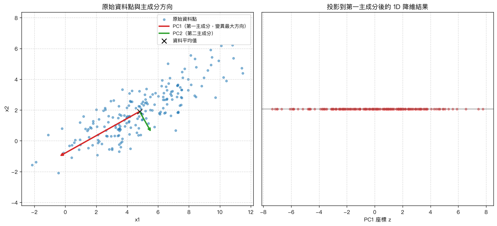
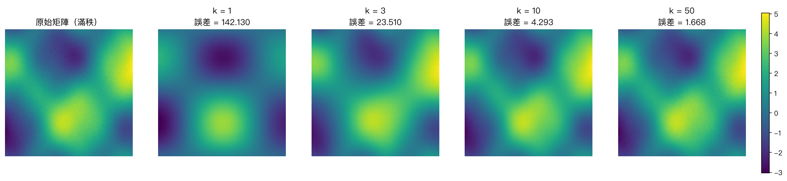
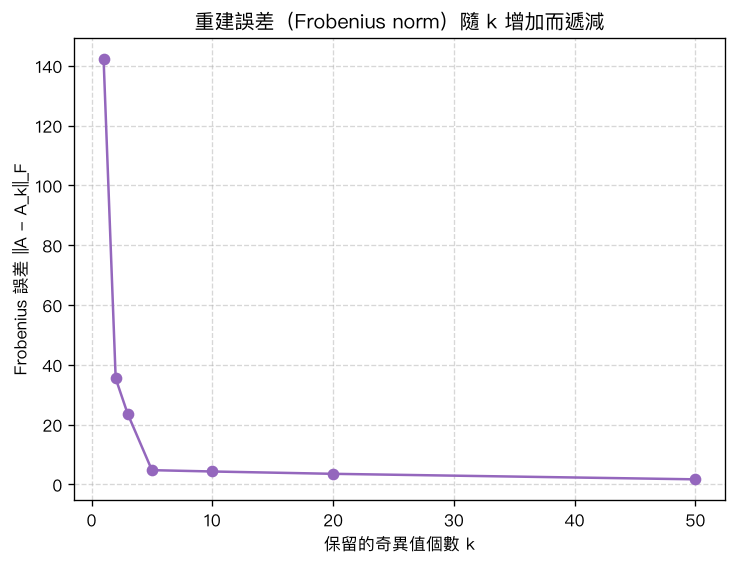

# 第 12 章：PCA 與 SVD 實務應用

## 學習目標

讀完本章後，你應該能夠：

- 說明 PCA（主成分分析，Principal Component Analysis）的動機：在高維資料中找出「變異量最大」的方向，藉此降維
- 說出資料中心化（centering）與標準化（standardization）的差異，以及各自適用的情境
- 手算 2D 資料的共變異數矩陣（covariance matrix）
- 理解 PCA 的兩種等價實作方式：對共變異數矩陣做**特徵分解**，或對資料矩陣直接做 **SVD**，並能交叉驗證兩者結果一致
- 用 Python（NumPy）手刻 PCA，並將資料投影到主成分方向完成降維
- 理解 SVD 低秩近似（low-rank approximation）的原理：用前 $k$ 個奇異值重建矩陣的近似值
- 用 Python 對一個模擬「圖像」矩陣做 SVD 壓縮，觀察不同 $k$ 值下的重建誤差與壓縮率
- 用 MATLAB 分別以 `eig()` / `svd()` 重現上述所有流程

## 概念說明

### 1. 為什麼需要 PCA？

真實世界的資料常常有很多個變數（維度），例如一份問卷可能有 50 道題目，一張圖片可能有數萬個像素。維度太高會造成：

- **難以視覺化**：人只能直觀理解 2D、3D 的圖形。
- **變數之間常有冗餘（redundancy）**：許多變數彼此高度相關，實際上「有效的資訊量」遠小於原始維度數。
- **計算與儲存成本高**：維度越高，後續分析（例如迴歸、分群）的計算量通常越大。

**PCA 的核心想法**：找出資料變異量（variance）最大的方向，稱為「主成分（principal component）」。第一主成分是變異最大的方向，第二主成分是「與第一主成分正交、且變異量次大」的方向，依此類推。把資料投影到前幾個主成分上，就能用較少的維度保留原始資料中大部分的資訊（變異量）。

這與第 8 章的「特徵值與特徵向量」、第 10 章的「SVD」直接相關：PCA 本質上就是這兩個工具的應用。

### 2. 資料中心化與標準化

在做 PCA 之前，通常要先對資料做以下兩步驟：

1. **中心化 (centering)**：把每個變數都減去自己的平均值，讓資料以原點為中心。

   $$
   x_i^{(c)} = x_i - \bar{x}
   $$

   這一步是**必要**的：如果不做中心化，共變異數矩陣的計算與「變異量最大方向」的意義都會被平均值的位置干擾。

2. **標準化 (standardization，可選)**：如果要進一步讓每個變數的尺度一致，可以再除以該變數的標準差：

   $$
   x_i^{(z)} = \frac{x_i - \bar{x}}{\sigma_i}
   $$

   **何時需要標準化？** 當各變數的單位或尺度差異很大時（例如身高用公分、體重用公斤、收入用萬元），變異數大的變數會主導 PCA 的結果，這時通常需要標準化。若各變數尺度本來就相近（或本身單位一致，例如像素強度），可以只做中心化。本章的範例資料兩個變數尺度相近，因此只示範中心化。

### 3. 共變異數矩陣

給定中心化後的資料矩陣 $X_c \in \mathbb{R}^{n \times p}$（$n$ 筆樣本、$p$ 個變數），**共變異數矩陣（covariance matrix）**定義為：

$$
C = \frac{1}{n-1} X_c^\top X_c \in \mathbb{R}^{p \times p}
$$

- $C$ 是一個 **對稱矩陣**（$C = C^\top$）。
- 對角線元素 $C_{ii}$ 是第 $i$ 個變數的變異數（variance）。
- 非對角線元素 $C_{ij}$（$i \neq j$）是第 $i$、第 $j$ 個變數之間的共變異數（covariance），數值越大代表兩變數線性相關程度越強。

### 4. PCA 原理：對共變異數矩陣做特徵分解

因為 $C$ 是對稱矩陣，根據第 8～9 章的內容，$C$ 可以被正交對角化：

$$
C = V \Lambda V^\top
$$

其中：

- $V = [v_1, v_2, \dots, v_p]$ 的每一行 column 都是 $C$ 的**特徵向量**，且彼此正交（orthogonal），這些方向就是**主成分方向**。
- $\Lambda = \mathrm{diag}(\lambda_1, \lambda_2, \dots, \lambda_p)$ 是對角矩陣，對角線上的**特徵值**代表資料在對應主成分方向上的**變異量**。

依慣例，我們把特徵值由大到小排序：$\lambda_1 \geq \lambda_2 \geq \dots \geq \lambda_p$，那麼：

- $v_1$（最大特徵值對應的特徵向量）就是**第一主成分（PC1）**方向：資料變異量最大的方向。
- $v_2$ 是**第二主成分（PC2）**方向：與 $v_1$ 正交、且變異量次大的方向。
- 依此類推。

每個主成分解釋的變異量比例為：

$$
\text{explained ratio}_i = \frac{\lambda_i}{\sum_j \lambda_j}
$$

**降維**：把中心化資料投影到前 $k$ 個主成分方向上，即可把 $p$ 維資料降成 $k$ 維：

$$
Z = X_c V_k, \qquad V_k = [v_1, \dots, v_k]
$$

### 5. PCA 原理：等價於對資料矩陣做 SVD

第 10 章介紹過，任何矩陣 $X_c \in \mathbb{R}^{n \times p}$ 都可以做 SVD：

$$
X_c = U \Sigma V^\top
$$

其中 $U$、$V$ 為正交矩陣，$\Sigma$ 為對角線上放奇異值（singular values）$\sigma_1 \geq \sigma_2 \geq \dots \geq 0$ 的矩陣。

把 $X_c = U \Sigma V^\top$ 代入共變異數矩陣的定義：

$$
C = \frac{1}{n-1} X_c^\top X_c
  = \frac{1}{n-1} (U \Sigma V^\top)^\top (U \Sigma V^\top)
  = \frac{1}{n-1} V \Sigma^\top U^\top U \Sigma V^\top
$$

因為 $U^\top U = I$（$U$ 的行向量正交且為單位向量），所以：

$$
C = V \left(\frac{\Sigma^\top \Sigma}{n-1}\right) V^\top = V \, \mathrm{diag}\!\left(\frac{\sigma_1^2}{n-1}, \dots, \frac{\sigma_p^2}{n-1}\right) V^\top
$$

**這與「對 $C$ 做特徵分解」的形式完全相同！** 因此可以得出兩個重要結論：

1. **SVD 的右奇異向量 $V$，就是共變異數矩陣 $C$ 的特徵向量**，也就是主成分方向。
2. **特徵值與奇異值的關係**：$\lambda_i = \dfrac{\sigma_i^2}{n-1}$。

換句話說：**「對共變異數矩陣做特徵分解」與「對中心化後的資料矩陣直接做 SVD」是完全等價的兩種 PCA 實作方式**。在數值計算上，直接對資料矩陣做 SVD 通常更穩定（不需要先計算 $X_c^\top X_c$，避免額外的數值誤差放大），這也是許多程式庫（例如 scikit-learn 的 `PCA`）內部採用 SVD 實作的原因。

> **關於正負號**：特徵向量（或奇異向量）$v$ 與 $-v$ 都同樣滿足 $Cv = \lambda v$，因此兩種方法算出來的主成分方向可能相差一個正負號，這不影響「方向」的意義，但比較數值是否一致時要特別處理（見下方 Python 實作）。

### 6. SVD 低秩近似原理

第 10 章介紹過 SVD 的**低秩近似定理（Eckart–Young theorem）**：給定 $A \in \mathbb{R}^{m \times n}$，其 SVD 為

$$
A = U \Sigma V^\top = \sum_{i=1}^{r} \sigma_i \, u_i v_i^\top, \qquad r = \mathrm{rank}(A)
$$

也就是說，$A$ 可以寫成 $r$ 個「rank-1 矩陣」$\sigma_i u_i v_i^\top$ 的加總，且奇異值 $\sigma_i$ 由大到小排序。

**低秩近似**：只保留前 $k$ 個奇異值/奇異向量（$k < r$），重建出的矩陣

$$
A_k = U_k \Sigma_k V_k^\top = \sum_{i=1}^{k} \sigma_i \, u_i v_i^\top
$$

是「在所有秩為 $k$ 的矩陣中，與 $A$ 的 Frobenius 距離最小」的矩陣，也就是最佳的 $k$ 秩近似。其重建誤差可以直接用被捨棄的奇異值算出：

$$
\|A - A_k\|_F = \sqrt{\sigma_{k+1}^2 + \sigma_{k+2}^2 + \dots + \sigma_r^2}
$$

因為捨棄的奇異值只會越來越少（$k$ 越大，被捨棄的項越少），所以**誤差 $\|A - A_k\|_F$ 會隨著 $k$ 增加而單調遞減（不會遞增）**，這也是本章 Python 實作中會實際驗證的性質。

**應用在圖像/矩陣壓縮**：如果一張圖像（或任何矩陣）的資訊高度集中在少數幾個主要「模式（pattern）」上（也就是奇異值快速遞減），那麼只保留前 $k$ 個奇異值，就能用遠比原始資料量小的儲存空間，重建出視覺上幾乎一樣的結果——這就是 SVD 壓縮的原理。儲存 $A_k$ 只需要 $U_k$（$m \times k$）、$\Sigma_k$ 的對角線（$k$ 個數）、$V_k$（$n \times k$），總共 $k(m+n+1)$ 個數字，相對於原始的 $mn$ 個數字，當 $k \ll \min(m,n)$ 時就能達到明顯的壓縮效果。

## Python 實作

完整程式碼請見同資料夾的 [`ch12_pca_applications.py`](./ch12_pca_applications.py)，重點摘要如下：

### Part A：手刻 PCA

```python
import numpy as np

np.random.seed(0)

# 產生具相關性的 2D 模擬資料（200 筆樣本）
theta = np.radians(30)
rotation = np.array([[np.cos(theta), -np.sin(theta)],
                      [np.sin(theta),  np.cos(theta)]])
latent = np.random.randn(200, 2) * np.array([3.0, 0.8])
X = latent @ rotation.T + np.array([5.0, 2.0])

# 1. 中心化
X_mean = X.mean(axis=0)
X_centered = X - X_mean

# 2. 共變異數矩陣
n = X_centered.shape[0]
cov_matrix = (X_centered.T @ X_centered) / (n - 1)

# 3. 特徵分解（C 對稱，用 eigh 更穩定），依特徵值由大到小排序
eigvals, eigvecs = np.linalg.eigh(cov_matrix)
order = np.argsort(eigvals)[::-1]
eigvals_sorted = eigvals[order]
eigvecs_sorted = eigvecs[:, order]
pc1_eig = eigvecs_sorted[:, 0]

# 4. 用 SVD 重做一次，交叉驗證
U, S, Vt = np.linalg.svd(X_centered, full_matrices=False)
eigvals_from_svd = (S ** 2) / (n - 1)
pc1_svd = Vt.T[:, 0]

# 特徵向量方向可能差一個正負號，用內積校正後再比較
if np.dot(pc1_eig, pc1_svd) < 0:
    pc1_svd = -pc1_svd
print(np.allclose(pc1_eig, pc1_svd))          # True
print(np.allclose(eigvals_from_svd, eigvals_sorted))  # True

# 5. 投影到第一主成分，完成降維 (2D -> 1D)
z_1d = X_centered @ pc1_eig
```

執行後的實際輸出（節錄）：

```
特徵值（由大到小排序）= [8.97024333 0.61460156]
第一主成分方向 PC1（特徵分解法）= [-0.87210701 -0.48931521]
各主成分解釋的變異量比例 = [0.93587778 0.06412222]

SVD 奇異值 S = [42.25018844 11.05919123]
由奇異值換算出的特徵值 S^2/(n-1) = [8.97024333 0.61460156]
兩者是否一致： True

PC1 特徵分解 vs SVD（校正正負號後）是否一致： True
PC2 特徵分解 vs SVD（校正正負號後）是否一致： True
>>> 驗證通過：特徵分解與 SVD 兩種方法求出的主成分方向一致。
```

可以看到：第一主成分解釋了約 93.6% 的變異量，代表即使把這組 2D 資料降成 1D，仍保留了絕大部分的資訊。

**原始資料點、主成分方向與投影到 PC1 的降維結果：**



左圖中紅色箭頭是 PC1（變異最大方向，長度與 $\sqrt{\lambda_1}$ 成比例），綠色箭頭是 PC2；可以看出 PC1 幾乎完全沿著資料點分布最長的方向。右圖是把所有資料點投影到 PC1 這一條線上後得到的 1D 座標，這就是降維後的結果。

### Part B：SVD 影像/矩陣壓縮

```python
import numpy as np

size = 100
coords = np.linspace(-3, 3, size)

# 用外積疊加出有明顯圖案的矩陣（棋盤條紋 + 漸層 + 高頻細節 + 微小雜訊）
pattern_1 = np.outer(np.sin(coords), np.cos(coords))
pattern_2 = np.outer(np.exp(-coords**2 / 4), np.ones(size))
pattern_3 = np.outer(np.ones(size), np.linspace(-1, 1, size))
pattern_4 = np.outer(np.cos(2 * coords), np.sin(3 * coords))
noise = 0.05 * np.random.RandomState(42).randn(size, size)
image = 3.0*pattern_1 + 2.0*pattern_2 + 1.0*pattern_3 + 0.5*pattern_4 + noise

# 對圖像矩陣做 SVD
U, S, Vt = np.linalg.svd(image, full_matrices=False)

def low_rank_approx(U, S, Vt, k):
    return U[:, :k] @ np.diag(S[:k]) @ Vt[:k, :]

# 用前 k 個奇異值重建，比較誤差
for k in [1, 2, 3, 5, 10, 20, 50]:
    A_k = low_rank_approx(U, S, Vt, k)
    err = np.linalg.norm(image - A_k, "fro")
    print(k, err)
```

執行後的實際輸出：

```
前 10 個奇異值 = [150.897 137.649  26.475  23.007   0.979   0.937   0.913   0.890   0.883   0.852]

   k |     Frobenius 誤差 |       相對誤差 |        壓縮率
----------------------------------------------------
   1 |       142.130243 |   68.5645% |    2.0100%
   2 |        35.406872 |   17.0805% |    4.0200%
   3 |        23.509616 |   11.3412% |    6.0300%
   5 |         4.736828 |    2.2851% |   10.0500%
  10 |         4.293000 |    2.0710% |   20.1000%
  20 |         3.511636 |    1.6940% |   40.2000%
  50 |         1.668205 |    0.8048% |  100.5000%

>>> 驗證通過：重建誤差（Frobenius norm）隨 k 增加而單調遞減（或持平）。
k = full_rank (100) 時的重建誤差 = 1.51e-13（應接近 0）
```

奇異值在第 4 個之後快速衰減（從 23.0 掉到 0.98），這正好反映了圖像矩陣主要由前 4 個 rank-1 成分構成、其餘只是微小雜訊。因此只用 $k=5$（壓縮率約 10%）就能把相對誤差壓到 2.3% 左右。

**原始矩陣與不同 $k$ 值重建結果的視覺化比較：**



**重建誤差隨 $k$ 增加而遞減的趨勢：**



**關鍵重點**：

- `np.linalg.eigh` 專門用於對稱矩陣的特徵分解，比通用的 `np.linalg.eig` 更快也更數值穩定，回傳的特徵值一定是實數且由小到大排序。
- `np.linalg.svd(X, full_matrices=False)` 回傳「經濟型（economy size）」的 $U, \Sigma, V^\top$，適合資料筆數遠大於變數個數的情境（$n \gg p$）。
- 比較兩個特徵向量是否代表同一個方向時，務必先用內積正負號對齊，再用 `np.allclose` 比較，而不要直接比較原始數值。
- 低秩近似 `U[:, :k] @ np.diag(S[:k]) @ Vt[:k, :]` 是 SVD 壓縮的核心公式，`k` 越小壓縮率越高，但誤差也越大，需要依應用情境權衡。

## MATLAB 實作

完整程式碼請見同資料夾的 [`ch12_pca_applications.m`](./ch12_pca_applications.m)，重點摘要如下：

```matlab
% 1. 中心化
X_mean = mean(X, 1);
X_centered = X - X_mean;

% 2. 共變異數矩陣
n = size(X_centered, 1);
cov_matrix = (X_centered' * X_centered) / (n - 1);

% 3. 特徵分解，依特徵值由大到小排序
[eigvecs, eigvals_diag] = eig(cov_matrix);
eigvals = diag(eigvals_diag);
[eigvals_sorted, idx] = sort(eigvals, 'descend');
eigvecs_sorted = eigvecs(:, idx);
pc1_eig = eigvecs_sorted(:, 1);

% 4. 用 SVD 重做一次，交叉驗證
[U, S, V] = svd(X_centered, 'econ');
singular_values = diag(S);
eigvals_from_svd = (singular_values .^ 2) / (n - 1);
pc1_svd = V(:, 1);

if dot(pc1_eig, pc1_svd) < 0
    pc1_svd = -pc1_svd;  % 校正正負號
end
disp(norm(pc1_eig - pc1_svd) < 1e-8);                        % 1 (true)
disp(norm(eigvals_from_svd - eigvals_sorted) < 1e-8);         % 1 (true)

% 5. 投影到第一主成分，完成降維
z_1d = X_centered * pc1_eig;
```

```matlab
% Part B：SVD 低秩近似
[U, S, V] = svd(image_mat, 'econ');
s = diag(S);

function A_k = low_rank_approx(U, s, V, k)
    A_k = U(:, 1:k) * diag(s(1:k)) * V(:, 1:k)';
end

for k = [1, 2, 3, 5, 10, 20]
    A_k = low_rank_approx(U, s, V, k);
    err = norm(image_mat - A_k, 'fro');
    fprintf('%d: %.6f\n', k, err);
end
```

**關鍵重點**：

- MATLAB 的 `eig(C)` 對一般矩陣不保證排序；本章程式用 `sort(eigvals, 'descend')` 手動依特徵值由大到小排序，並同步重排特徵向量矩陣的行。
- `svd(X, 'econ')` 對應 Python 的 `np.linalg.svd(X, full_matrices=False)`，回傳「經濟型」分解，注意 MATLAB 回傳的是 `V`（不是 `V'`），與 NumPy 回傳 `Vt`（即 $V^\top$）的慣例不同，使用時要特別注意轉置。
- 本章刻意不使用 Statistics and Machine Learning Toolbox 的 `pca()` 函式，而是用 `eig()` / `svd()` 手動實作，以維持基礎版本相容性，並讓 PCA 的數學原理更透明。
- MATLAB 腳本中的資料以固定數值寫死（PCA 用 24 筆手算資料點；圖像矩陣用 `sin`/`cos`/`linspace` 等確定性公式生成，並用固定公式取代亂數雜訊），避免因為 MATLAB 與 Python 的亂數產生器不同步，導致兩邊算出的數字對不起來。

## 重點整理

- **PCA 動機**：在高維資料中找出變異量最大的方向（主成分），藉由投影到前幾個主成分完成降維，同時保留大部分資訊。
- **前處理**：中心化（減去平均值）是必要步驟；標準化（再除以標準差）視變數尺度是否一致而定。
- **共變異數矩陣** $C = \dfrac{1}{n-1}X_c^\top X_c$ 是對稱矩陣，描述各變數的變異量與變數間的相關程度。
- **PCA 的兩種等價實作**：
  1. 對 $C$ 做特徵分解：特徵向量 = 主成分方向，特徵值 = 該方向的變異量。
  2. 對中心化資料 $X_c$ 直接做 SVD：右奇異向量 $V$ = 主成分方向，且 $\lambda_i = \sigma_i^2/(n-1)$；數值上通常更穩定。
- 比較兩種方法算出的主成分方向時，要注意特徵向量方向可能相差正負號，需先用內積校正再比較。
- **SVD 低秩近似**：$A_k = U_k \Sigma_k V_k^\top$ 是「秩為 $k$ 的最佳近似」，重建誤差 $\|A-A_k\|_F = \sqrt{\sum_{i>k}\sigma_i^2}$ 會隨 $k$ 增加而單調遞減，這正是圖像/矩陣壓縮的數學基礎。
- Python 用 `np.linalg.eigh`（對稱矩陣特徵分解）與 `np.linalg.svd`；MATLAB 用 `eig()` 與 `svd(..., 'econ')`，但排序、回傳格式（`V` vs `Vt`）等細節需特別留意。

## 練習題

1. 給定共變異數矩陣 $C = \begin{bmatrix} 4 & 2 \\ 2 & 1 \end{bmatrix}$，手算其特徵值與特徵向量，並指出哪一個方向是第一主成分。

   **提示**：先解 $\det(C-\lambda I)=0$ 得到 $\lambda^2 - 5\lambda = 0$，故 $\lambda_1=5,\ \lambda_2=0$；特徵值較大的 $\lambda_1=5$ 對應的特徵向量方向就是第一主成分（此例中 $C$ 是奇異矩陣，代表資料其實落在一條直線上，第二主成分方向的變異量為 0）。

2. 若某組資料做 PCA 後，四個主成分解釋的變異量比例分別為 $[0.70, 0.20, 0.06, 0.04]$，若要保留至少 90% 的總變異量，最少需要保留幾個主成分？

   **提示**：累加比例，$0.70+0.20=0.90$，因此保留前 2 個主成分即可達到（恰好）90%。

3. 為什麼比較「特徵分解法」與「SVD 法」算出的主成分方向時，不能直接用 `==` 或原始數值比較，而要先校正正負號？

   **提示**：想想 $Cv=\lambda v$ 這個方程式，把 $v$ 換成 $-v$ 是否仍然成立？兩個演算法內部實作不同，收斂到 $v$ 或 $-v$ 都是合法解。

4. 給定一個 $100 \times 100$ 的矩陣，其奇異值中只有前 5 個明顯大於 0（其餘接近 0）。若只用前 5 個奇異值做低秩近似，估計儲存空間相對於原始矩陣的壓縮率大約是多少？

   **提示**：壓縮後需儲存 $k(m+n+1)$ 個數字，代入 $k=5,\ m=n=100$，除以原始的 $m \times n = 10000$ 個數字，算出比例。

5. 承練習題 4，若把 $k$ 從 5 增加到 10，重建誤差 $\|A-A_k\|_F$ 會變大、變小，還是不一定？請用 Eckart–Young 定理的公式說明原因。

   **提示**：$\|A-A_k\|_F=\sqrt{\sigma_{k+1}^2+\cdots+\sigma_r^2}$，$k$ 越大，被加總的項越少（因為都是非負的平方項），所以誤差必定不會增加，只會遞減或持平。

## 教程總結

到這裡，我們完成了這套線性代數教程的最後一章。回顧整個學習路徑，可以看到這些概念其實是環環相扣、層層堆疊上來的：

- 第 1～2 章的**向量**與**線性組合／生成空間**，讓我們有了描述「資料點」與「方向」的語言；
- 第 3～4 章的**矩陣**與**線性方程組**，讓我們能把大量資料與運算整理成統一的代數形式，並知道如何求解 $Ax=b$；
- 第 5～7 章的**行列式**、**逆矩陣／LU 分解**、**向量空間**，補齊了判斷矩陣性質（可逆性、秩、子空間結構）的工具箱；
- 第 8～9 章的**特徵值／特徵向量**與**正交性／QR 分解**，讓我們理解矩陣如何「拉伸」與「旋轉」空間中的向量，以及如何找到彼此垂直的座標系；
- 第 10 章的 **SVD**，把「特徵分解只能用在方陣」的限制打破，提供了適用於任意矩陣、數值上更穩定的分解工具；
- 第 11 章的**最小二乘法**，示範了如何用這些工具在真實（帶有雜訊）的資料中找出最佳擬合；
- 而本章的 **PCA 與 SVD 實務應用**，則把特徵分解與 SVD 這兩個核心工具，串成一套完整的「資料降維」與「矩陣壓縮」方法，回頭呼應了最初的問題——如何用更精簡的方式，抓住資料中最重要的結構。

如果你是照順序讀到這裡，希望你能感受到：線性代數不是一堆孤立的公式，而是一組彼此支撐的概念——向量提供語言，矩陣提供運算，特徵值與 SVD 提供洞察資料結構的眼睛，而 PCA、最小二乘法這類應用，則是把這些眼睛真正用在解決問題上。建議之後遇到新的資料科學或機器學習方法時，都可以回頭想想：這背後用到的是哪一章的概念？這樣的複習方式，會比單獨背誦公式更有效。

祝你在後續的學習與應用中順利！
